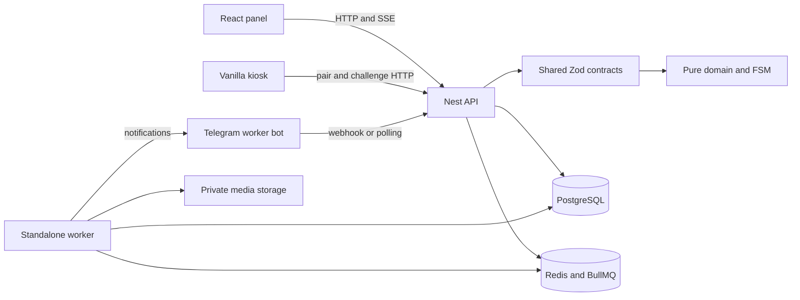

# Architecture and Codebase Audit

> Owner update, later on 2026-09-10: the direct-master/current-repository workflow in
> [AGENTS.md](../../../AGENTS.md) supersedes this audit's PR, branch-protection and worktree proposals.
> The audit worktree was removed after its commit was preserved in master. Historical measurements
> remain valid for their recorded sample. Use [the current operating model](../../engineering/agent-operating-model.md).

## Scope and evidence

This audit inspects baseline `08979de0c9c9c72b79bd03f74c2b8b500cf438ad` in an isolated worktree.
It covers repository source, package manifests and lockfile, configuration, tests, Git history and
read-only GitHub delivery metadata collected on 2026-09-10. Later setup files are identified separately;
their presence must not be mistaken for baseline capability. The scope is recon, audit and setup,
without changing application behavior or public APIs.

Evidence labels distinguish **observed source/configuration**, **executed verification**, **source-inferred
risk requiring reproduction**, and **unavailable data**. A passing test count is not a coverage percentage;
a successful CI run is not proof of deployment. Supporting measurement definitions and GitHub evidence
are in the [Lean report](lean-bottlenecks.md) and its metrics artifact. Prior runtime observations are in
[worker-bot QA](../../engineering/features/worker-bot-qa.md); this audit does not claim new phone tests.

## 1. RECON — facts only

### Product and stack

Vakhta tracks worker presence, shifts, intervals, handover, incidents, requests and related bonus/reporting
workflows for continuous production. Employees use Telegram; masters and administrators use the panel;
paired checkpoint kiosks expose rotating attendance challenges. The domain distinguishes personal
activity intervals from incidents. These records do not by themselves measure machine output or OEE.[^1]

The monorepo has four applications and five shared/configuration packages. Package installation uses
pnpm 10.9.0 and workspace linking, builds use Turborepo, and runtime modules use ESM. The Node version
file selects major 22; the engine constraint is at least 22.12. Local inspection used Node 22.23.1.
The root package is version 0.70.0; internal packages retain independent private manifest versions.[^2]

| Area              | Resolved version after frozen install          | Existing implementation                                                    |
| ----------------- | ---------------------------------------------- | -------------------------------------------------------------------------- |
| Language/build    | TypeScript 5.9.3, Vite 7.3.6                   | Shared strict tsconfigs; Node packages compile to dist exports             |
| Panel             | React/React DOM 19.2.8, React Compiler 1.0.0   | Client-rendered Vite, createRoot/StrictMode, compiler target 19            |
| Panel state/UI    | Query 5.102.8, Zustand 5.0.15, Tailwind 4.3.3  | Mixed new state libraries and legacy hooks; copied shadcn primitives       |
| API               | Nest 11.2.3, Fastify 5.11.3, Better Auth 1.7.2 | Nest feature modules, cookie sessions, role and data-scope services        |
| Telegram/jobs     | grammY 1.46.0, BullMQ 5.81.4                   | Worker bot inside API; standalone TypeScript background worker             |
| Data/contracts    | Drizzle 0.44.7, Zod 4.5.4                      | PostgreSQL schemas/migrations and shared command/response/job contracts    |
| Tests             | Vitest 3.2.7, Testcontainers 11.14.0           | Pure/property/component and real DB/Redis integration tests                |
| Support assistant | Anthropic SDK 0.124.0                          | Separate support flow with repository knowledge and optional audio adapter |

These are resolved dependencies, not the lower bounds printed in semver ranges. Local/test PostgreSQL
is 16 (`postgres:16-alpine`); Redis integration tests use 7-alpine. The backup workflow installs a PG 18
client and comments that Railway uses 18. The production server version was not independently queried;
that configuration evidence must not be presented as a live version measurement.[^2][^3]

### Actual architecture and dependency boundaries

`packages/domain` owns pure rules, time calculations, authorization concepts and shift transitions.
Its root and `./node` exports separate browser-compatible rules from Node crypto helpers. Contracts
depend on domain, and DB schema/client exports depend on domain. All are private packages; no npm
publication or external package consumer was found. External clients of HTTP, Telegram deep links,
SSE and persisted jobs may exist outside this checkout and were not exhaustively inventoried.[^4]

The API uses feature-oriented Nest modules rather than FSD presentation layers. ShiftService executes
row-locked transitions, checks expectedVersion, closes/opens intervals, appends events and stores an
idempotency response within a transaction. Timer effects run after commit. This is a transactional
state/projection architecture with an append-only event log, not full asynchronous event sourcing.
The worker consumes jobs and notification-outbox rows, re-reads state and uses bounded concurrency.[^5]

The panel has feature folders such as `admin`, `schedule`, `operations`, `incidents`, `handover`,
`requests`, `reports`, `bonus`, `overview` and `audit`, plus global `api.ts`, `lib`, `components/app` and
`components/ui`. It does not currently implement a complete `app/pages/widgets/features/entities/shared`
hierarchy or consistent slice public APIs. The kiosk has a 423-line vanilla entry module. The panel uses
custom hash routing and a custom table implementation; TanStack Table, Virtual and Router are not
installed. React Server Components and Next.js are not part of this runtime.[^6]

### State and types

The panel has one QueryClient, a query-key factory and newer Query-backed operations/report screens.
Client state is split between a generic Zustand-backed screen-state helper, a schedule draft store,
legacy useState/context and effects. Query owns some server reads while other screens fetch directly;
Operations mutations still pass through a direct useAction/API path. SSE invalidates Query but its
subscription lifecycle remains effect-based.[^7]

An AST scan of 373 TypeScript/TSX files under apps and packages, including tests/configuration and excluding
node_modules, dist and .turbo, found **zero explicit AnyKeyword nodes**, **12 nested as expressions**
(five in production services, seven in tests), **379 non-null assertions**, and no textual ts-ignore,
ts-expect-error or eslint-disable directives. Those counts are syntax inventory, not 379 proven defects.
The five production double casts are in incidents.service.ts:291/881, org.service.ts:244 and
shift.service.ts:787/1002. Strict flags include strict, noUncheckedIndexedAccess, exactOptionalPropertyTypes,
noImplicitOverride, unknown catch variables and isolatedModules; skipLibCheck remains enabled.[^8]

The frontend AST subset contains 110 calls to the four project-forbidden hooks across 36 files: 102 in
application code and 8 in copied UI primitives. Counts exclude comments/imports and match direct named
or property calls, so renamed aliases are a stated limitation of the method. Application totals are
58 useEffect, 18 useMemo, 11 useRef and 15 useCallback. Frontend code contains no explicit any or double
casts, but generic assertions still cross unchecked runtime boundaries.[^6][^7]

### Tests, CI and conventions

The suite contains 66 test files: domain 18, contracts 1, i18n 1, API 24, worker 6 and panel 16, totaling 362
reported tests. Domain tests include fast-check properties; API/worker tests use actual PostgreSQL and
Redis containers. The API E2E file boots Nest/Fastify and checks sessions, roles, CORS and protected
routes. Panel tests use jsdom and testing-library, with mocked matchMedia, Radix menus/dialogs and
visibility settings. No browser E2E framework/configuration or kiosk test script was found. No coverage
provider/threshold configuration or measured statement/branch percentage was found.[^9]

`pnpm check` runs typecheck, lint, tests and formatting; it does not build every production application.
The CI check job separately runs frozen install, build, typecheck, lint, format and tests. PRs also
build container images without pushing. Master pushes can run semantic-release, publish images,
announce release notes and run the Pages job. Railway IaC watches master with checkSuites enabled and
configures a migration pre-deploy command. The nightly backup workflow is enabled by a repository
variable; its configuration is not proof of a successful restore.[^10]

Read-only GitHub inspection found no branch protection for master (404 “Branch not protected”), no
repository rulesets, and zero PRs in the all-state listing. Thus the workflow exists but its checks are
not required before a direct master push. PR open-to-merge time, review waiting and re-review counts
are unavailable, not zero-cost processes. The Lean report measures CI durations separately.[^11]

Recent Git subjects consistently use Conventional Commits. `.releaserc.json` already controls releases:
feat is minor, fix/perf/refactor/config/infra are patch, while docs/ci/chore/test/style do not trigger a
release on their own. Root AGENTS, a CLAUDE import adapter, feature docs, ADRs, runbooks and a product
Lean skill exist. At baseline there was no CONTRIBUTING guide, PR template, Cloud setup entry point,
scoped delivery role prompts or capped handoff file. There is no configured commitlint hook. Several
ADRs remain marked proposed even where corresponding architecture is implemented.[^12]

### Pain-point evidence

No meaningful TODO/FIXME/HACK/XXX work item was found in the scoped source scan; literal activation-code
patterns and mktemp templates are not TODOs. The worker's bonus queue still logs a future-handler
message in main.ts:166–172, which is a concrete placeholder without a TODO marker. Test infrastructure
explicitly duplicates Docker/database setup across API and worker. Services also cross boundaries:
ShiftService imports Telegram summary formatting, and Overview imports a schedule preset and a UI type.
These are concrete coupling/reuse examples rather than conclusions from directory names.[^5][^6][^13]

A historical CI test race was fixed in commit 8ec3920 according to the delivery evidence; the audit does
not propose redoing that fix. No reverted PR can be inferred because the PR inventory is empty. Green
Pages jobs also need careful interpretation: all 91 successful CI runs in the Lean sample skipped both
actual deploy steps. This establishes a deployment-evidence gap, not that the current live frontend is
necessarily stale; another deployment path may be used.[^11]

## 2. AUDIT — gaps, alternatives and migration risk

Priority is correctness, specification, architecture, maintainability, type safety, testability,
performance, then delivery speed. The established backend/domain design should be retained. FSD is a
frontend migration target applied to coherent slices, not a justification for relabeling every backend
folder or replacing the kiosk. Findings below distinguish risk from a reproduced production failure.

| Area                        | Current vs target and concrete evidence                                                                                                                | Migration risk and reason                                                                                                                    |
| --------------------------- | ------------------------------------------------------------------------------------------------------------------------------------------------------ | -------------------------------------------------------------------------------------------------------------------------------------------- |
| Specification and ownership | Feature docs and ADRs exist, but ADR proposed statuses and no consistent accepted spec/handoff contract leave authority unclear                        | Low for templates/status reconciliation; high if stale prose overrides FSM or DB invariants                                                  |
| FSD boundaries              | OverviewPage23 imports schedule/preset; overview/attention3 imports a presentation type; api/lib/global components bypass slice APIs                   | Medium: extract one public model boundary with regression coverage; avoid mass path moves                                                    |
| UI responsibility           | EmployeesTab1399 lines, SchedulePage754, OperationsPage678; table performs filter/sort/pagination itself                                               | Medium: move actual rules into typed models/actions, not a forwarding class; keep rendering and browser mechanics understandable             |
| React policy                | Compiler exists but102 owned calls violate the target hook policy; eslint-plugin-react-hooks is installed but unused in ESLint                         | Medium/high for subscriptions and DOM integration. Do not remove cleanup or wrap forbidden hooks to satisfy a text scan                      |
| Server/client ownership     | Query migration partial, direct mutations/useState fetches remain; generic UI store assertions hide key/value correspondence                           | Medium: define state ownership and cancellation before migrating a touched slice                                                             |
| Account isolation           | useSession28–34 clears local session on logout; no production Query clear/removeQueries or persistent-state reset found; some keys lack identity/scope | High: source-inferred stale-user-data/draft risk. Reproduce account switch and pending-response behavior before changing lifecycle           |
| Async schedule              | loadDetail181–201 commits results unconditionally; effect guard protects catch, not stale success                                                      | High: deferred A/B-response test first, then cancellation/selection ownership. Production corruption not demonstrated                        |
| Kiosk refresh               | main299–343 and 364–390 have no in-flight/generation guard during timer refresh and terminal switching                                                 | High: old-terminal/overlapping response hypothesis; reproduce with two terminals and controlled network before changing arrival flows        |
| Runtime type safety         | apiFetch returns body as T; idempotency replay casts JSON into success types; strict compiler cannot validate stored/remote data                       | Medium: add schema parsing at genuine boundaries without duplicating domain types or rejecting valid older persisted records                 |
| Async backend recovery      | update-dedup claims before handler execution; shift afterCommit skips replayed responses and runs non-durable deferred jobs after DB commit            | High: crash/retry gaps are source-inferred; fault-injection tests and recovery design precede any transactional rewrite                      |
| Error visibility            | attention query turns seven source failures into null; timer cancellation catches every remove failure                                                 | Medium: distinguish partial/unavailable from zero; classify benign cancellation races separately from operational failures                   |
| Clean Code/SOLID            | Table optional selectedKeys/onSelectionChange can form an incomplete contract; DB orchestration imports Telegram formatting                            | Medium: use a discriminated selection contract and a neutral formatter boundary when touched; not every independent boolean prop is a defect |
| Accessibility               | Semantic labels/focusable rows exist; mocked media queries/overlays prevent tests from proving actual mobile/focus behavior                            | Medium: real browser regression cases before changing primitives; accessibility is part of correctness                                       |
| Tests and measurement       | Strong domain/integration base; no measured branch coverage, browser suite, kiosk tests or full bot orchestration harness                              | Low for baseline/reporting; medium for robust isolated E2E infrastructure. Do not invent coverage percentages                                |
| Delivery gates/provenance   | Master unprotected, PR inventory empty, sampled Pages deploy steps skipped                                                                             | Low implementation size but high operational impact. Remote changes need explicit owner application; evidence before speed optimization      |
| Performance                 | Local production build reports an index chunk 1849.62kB / 553.80kB gzip and a Vite warning                                                             | Medium: profile navigation/loading and split a measured boundary; this is bundle size, not a runtime latency benchmark                       |

The frontend risks are grounded in source, not live exploitation or reproduced record damage. In
particular, API authorization still applies even where client cache isolation is questionable. The
account-switch regression should establish exactly what can remain visible and for how long.[^7][^8]

### React 19/RSC reconciliation

React 19 does not deprecate useEffect/useMemo/useRef/useCallback; the repository's ban is an explicit
local architecture policy. Compiler-supported memoization reduces the need for manual memoization but
does not replace effect ownership or subscription cleanup. Suspense, Actions and transitions should be
chosen against installed capabilities and concrete requirements. “RSC by default” applies when an
architecture supports server components; this Vite SPA has no such execution boundary. No Next.js or
RSC migration is justified by this audit alone.[^14]

### Existing safety boundaries to preserve

Keep the pure FSM, append-only events/audit constraints, optimistic version checks and server-side
scope filtering. Do not alter public UPPER_SNAKE_CASE codes, locale catalogs, JSON/job contracts or
Telegram callback encodings incidentally. An employee's finish button starts cleaning; actual closure
follows the established checklist/exit QR, master-comment or system path. New nested instructions
reinforce these boundaries rather than introduce a replacement domain architecture.[^1][^4][^5]

## 3. Setup decisions and validation

The setup reconciles and extends existing AGENTS/CLAUDE/standards rather than replace them with generic
boilerplate. Root rules gain priorities, SPEC OPS, a Definition of Done, async/review rules and worktree
ownership. Four nested AGENTS files encode genuinely different pure-domain, Nest, worker and kiosk
constraints. No fictional shared-layer directory is created just to host an instruction file.

The PR template and contribution guide reuse the actual semantic-release convention and scripts. The
Cloud script draft installs pinned dependencies and builds exports; optional Docker image preloading
is explicit. No database, webhook, credential or hosted environment is configured. Testing baseline
and migration backlog remain proposals, not a new coverage gate that would break unrelated work.

The operating model separates Architect, Implementer, independent Reviewer, independent QA and delivery
Lean/Process Expert. Existing manufacturing Lean advice remains separate. Codex supports scoped
parallel subagents in the current environment; the contrary premise is outdated. Markdown roles do not
create persistent background workers. Automatic Reviews are recommended but their account setting was
not inspected or enabled. See the [operating model](../../engineering/agent-operating-model.md).[^15]

Executed baseline: frozen install, production build and pnpm check passed. The first check used cached
Turborepo test results; a forced test run then passed all 362 tests in 66 files without cached tasks. Final
results and setup-script execution are recorded in the audit index. Build emitted the bundle-size
warning described above, not a failed build. No code coverage percentage was collected.

## 4. Work deliberately outside this change

No business logic, public API, DB schema/migration, React screen, package dependency/lockfile or existing
test expectation is changed. No authentication/authorization setting, GitHub branch rule, deployment,
webhook, release announcement or employee record is modified. Risks are recorded as small follow-up
PRs because changing high-impact state lifecycles during an onboarding audit would make the findings
and the baseline harder to review. Runtime product observations from the earlier QA remain explicitly
separate from local setup verification.

## Sources

[^1]: [Product overview](../../features/01-overview.md), [shift flow](../../features/04-shift-flow.md), baseline AGENTS.md code invariants and [incident behavior](../../features/07-incidents-and-downtime.md).

[^2]: [Root manifest](../../../package.json), [workspace configuration](../../../pnpm-workspace.yaml), [lockfile](../../../pnpm-lock.yaml), .node-version; `pnpm list --recursive --depth 0 --json` after frozen installation.

[^3]: [API DB fixture](../../../apps/api/test/db.ts):20, [Redis E2E fixture](../../../apps/api/src/app.e2e.test.ts):30, [backup workflow](../../../.github/workflows/db-backup.yml):23.

[^4]: [Domain exports](../../../packages/domain/package.json), [contracts exports](../../../packages/contracts/package.json), [DB exports](../../../packages/db/package.json), [Zod pipe](../../../apps/api/src/common/zod.pipe.ts), [kiosk controller](../../../apps/api/src/kiosk/kiosk.controller.ts), [web auth guard](../../../apps/api/src/auth/web-auth.guard.ts).

[^5]: [ShiftService](../../../apps/api/src/shift/shift.service.ts):63,126,446,474,688,787,1002,1007; [worker entry](../../../apps/worker/src/main.ts), [outbox relay](../../../apps/worker/src/outbox/relay.ts):102,116,149; [ADR 0001](../../adr/0001-event-log-with-transactional-projections.md), [ADR 0008](../../adr/0008-outbox-and-timers.md).

[^6]: [Panel entry](../../../apps/admin-web/src/main.tsx):24, [Vite/compiler](../../../apps/admin-web/vite.config.ts):7, [hash routes](../../../apps/admin-web/src/lib/route.ts):13, [DataTable](../../../apps/admin-web/src/components/app/data-table.tsx):104,245,293,343, [Overview](../../../apps/admin-web/src/overview/OverviewPage.tsx):23, [kiosk entry](../../../apps/qr-kiosk/src/main.ts):299,364.

[^7]: [Query client](../../../apps/admin-web/src/lib/query.ts):11,27, [generic UI store](../../../apps/admin-web/src/lib/ui-store.ts):14,37, [auth lifecycle](../../../apps/admin-web/src/auth/useSession.ts):12,28, [schedule](../../../apps/admin-web/src/schedule/SchedulePage.tsx):61,181, [attention model](../../../apps/admin-web/src/overview/attention.ts):3,73, [live invalidation](../../../apps/admin-web/src/lib/live.ts):20.

[^8]: [Strict config](../../../packages/config/tsconfig.base.json), [ESLint](../../../eslint.config.js), [API fetch](../../../apps/admin-web/src/api.ts):24, [incidents service](../../../apps/api/src/incidents/incidents.service.ts):291,881, [org service](../../../apps/api/src/org/org.service.ts):244. Syntax inventory uses TypeScript 5.9.3 createSourceFile/traversal, not word counts of `any` in prose.

[^9]: [API E2E](../../../apps/api/src/app.e2e.test.ts), [API Vitest](../../../apps/api/vitest.config.ts), [worker Vitest](../../../apps/worker/vitest.config.ts), [panel setup](../../../apps/admin-web/src/test-setup.ts):23,41,99, [panel test client](../../../apps/admin-web/src/test-utils.tsx):10, [panel tests configuration](../../../apps/admin-web/vitest.config.ts), [kiosk manifest](../../../apps/qr-kiosk/package.json).

[^10]: [CI](../../../.github/workflows/ci.yml), [Railway IaC](../../../.railway/railway.ts):20, [backup workflow](../../../.github/workflows/db-backup.yml), [Turborepo tasks](../../../turbo.json).

[^11]: [Lean report and live GitHub API evidence](lean-bottlenecks.md). Accessed 2026-09-10; samples and run URLs are defined there.

[^12]: [Release rules](../../../.releaserc.json), baseline Git log through 08979de, [existing Claude adapter](../../../CLAUDE.md), [ADR 0002 status](../../adr/0002-shift-fsm-as-data-with-db-invariants.md):3.

[^13]: [API Docker helper](../../../apps/api/test/docker.ts), [worker duplicated fixture](../../../apps/worker/test/db.ts):14, [dedup claim](../../../apps/api/src/telegram/update-dedup.ts):16, [timer cancellation](../../../apps/api/src/infra/timers.queue.ts), [bot middleware](../../../apps/api/src/telegram/bot.factory.ts):234.

[^14]: [React Compiler](https://react.dev/learn/react-compiler/introduction), [React hooks](https://react.dev/reference/react/hooks), [FSD layers](https://fsd.how/docs/reference/layers/). Framework applicability is an architectural judgment based on the inspected runtime.

[^15]: [Codex subagents](https://learn.chatgpt.com/docs/agent-configuration/subagents), [Cloud environments](https://learn.chatgpt.com/docs/environments/cloud-environment), [GitHub Code Review](https://learn.chatgpt.com/docs/third-party/github), accessed2026-09-10. Repository settings and hosted runtime capability still require separate verification.
