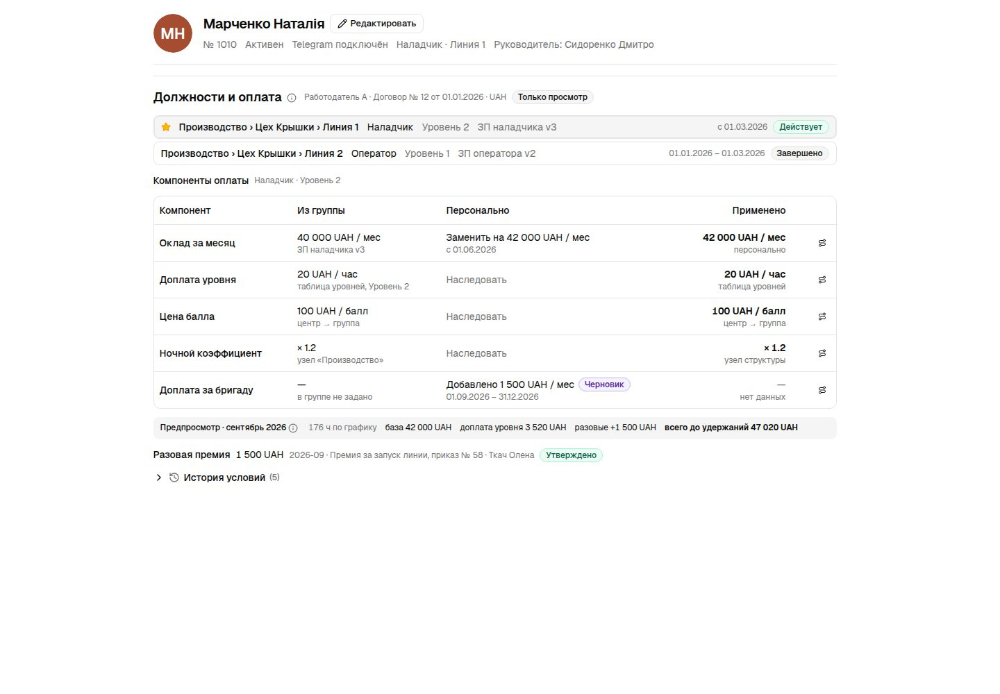

# Employee pay terms prototype captures, 2026-09-24

Fixture-rendered states of the card section «Должности и оплата» (spec 015), captured by
`apps/admin-web/e2e/pay-terms.spec.ts` from `apps/admin-web/e2e/pay-terms.html?state=<key>` on
the preinstalled Chromium. Desktop is 1440 px; mobile is iPhone 13 (390 px). Prototype copy is
Russian, the base UI language. The node block «Условия оплаты» is captured with the org structure
set (`../org-structure-2026-09-24/section-desktop.jpg`).

## Reading

The section: employment line, assignments, components with «Из группы · Персонально ·
Применено», month preview, one-time corrections, history.

Resolution path of one component (CFG-07).

History expanded: draft supplement, one-time bonus, personal replace, transfer, migration.

## Access variants

Accountant: read without editing.

Names only: a role that sees groups and levels without amounts.

## Editors

Personal replace of a component (Sheet with value, unit, dates, after-end rule, reason,
was → becomes).

Add a supplement.

Level change from the position's scale with a per-month preview (PROC-05).

One-time correction (GRP-09).

Transfer with old and new sources and a decision per personal exception (PROC-06, CFG-06).

## Mobile

