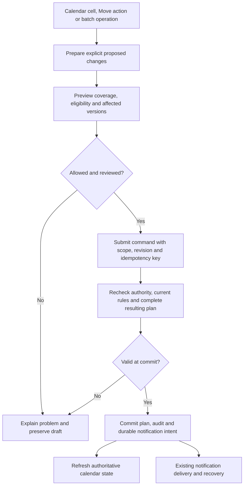

# Deputy and When I Work calendars: functionality, code, UX and manufacturing design

Deputy and When I Work provide workforce scheduling workspaces: their calendars coordinate people,
work intervals, organizational scope, eligibility and publication. The useful model for Vakhta is a
new interface over its scheduling domain, with explicit extensions where that domain is insufficient.
Existing shift templates, monthly schedules, rotations and publication must remain available.

Deputy is particularly informative for work across several areas within one shift. When I Work is
particularly informative for employee/resource views, OpenShifts, candidate selection and validation
before assignment. Neither product's public documentation establishes that its complete calendar is
an independently reusable component. Public API contracts and a small Deputy rule-recipe repository
are available; the current private calendar implementation, rendering engine and transaction code
were not available for inspection.[^1][^2][^3][^4]

The recommendation is to preserve Vakhta's scheduling engine, build a task-oriented desktop/mobile
workspace, and add staffing requirements, explainable eligibility and safe changes in stages. Copy
interaction principles after adapting them to manufacturing; do not copy undocumented assumptions
about approval, day boundaries, qualifications or history retention.

## Evidence and scope

This report covers official help articles, visible desktop/mobile illustrations, public developer
documentation and public repository files available on 2026-09-12. It is not an authenticated trial,
benchmark, security audit or inspection of either company's private source. Published API behavior
is documented behavior, not a successful live request against a customer account. Native iOS/Android
illustrations do not establish mobile-web parity.

Source dates matter. Deputy's micro-scheduling and auto-scheduling guides were updated in July 2026;
When I Work's API-access guide in August 2026. Several mobile and automation guides are older.
The Deputy recipe repository's inspected revision dates from 2021. Feature availability can depend
on account settings, plan and rollout; no price or entitlement comparison is implied.[^1][^5][^6]

**Evidence labels:** “Documented” means an explicit primary-source statement; “Observed” means a
visible reference image or repository file; “Interpretation” explains likely design consequences;
“Recommendation” specifies proposed Vakhta behavior. Competitor behavior is not an accepted Vakhta
operating policy. The canonical scope remains the [50-capability feature catalog](../features/schedule-calendar-redesign.md):
46 target capabilities and four separately gated extensions, with implementation not started.

## Product model and terminology

The calendar must answer three distinct questions: where is work required, who is assigned, and what
happens during the assignment? Changing the grouping should change the perspective on the same plan.
It must not create separate copies of “the department schedule” and “the employee schedule.”

| Concept              | Deputy evidence                                         | When I Work evidence                                                                               | Vakhta interpretation                                                 |
| -------------------- | ------------------------------------------------------- | -------------------------------------------------------------------------------------------------- | --------------------------------------------------------------------- |
| Organizational scope | Location and area; Roster references an OperationalUnit | Schedule/location, position and job site                                                           | Map site, organizational unit, zone and position deliberately         |
| Planned work         | A Roster is a single shift                              | A shift belongs to a schedule and can have an assignee                                             | Preserve a planned assignment distinct from actual attendance         |
| Person perspective   | Employee scheduling and linked work parts               | Users view gives each person a row                                                                 | Employee view is a projection, not a second record                    |
| Unfilled work        | Empty and Open are distinct in auto-fill                | Auto-assign consumes unpublished OpenShifts                                                        | Separate unassigned planning capacity from an offer to employees      |
| Intra-shift work     | Micro-scheduled parts across areas                      | Job/position/site assignment is documented; equivalent linked micro-parts are not established here | Introduce ordered segments only with explicit parent/part semantics   |
| Publication          | Roster publication and confirmation fields              | Publication, notification and acknowledgement fields                                               | Retain monthly review/version ownership and model delivery separately |

The terminology above is supported by the Roster model, schedule views, micro-scheduling, labor
sharing and automation documentation.[^1][^2][^3][^5][^7][^8]

In particular, a When I Work “Schedule” is an organizational scheduling container. It must not be
mapped mechanically to Vakhta's monthly `ScheduleVersion`. Similarly, a calendar card is a rendered
representation; its appearance does not establish whether a backend record represents one person,
one open position, several instances or a segment.

## Functional and interaction comparison

### Desktop views and visual hierarchy

When I Work separates time range, staff grouping and color mode. Its time views include day, week,
two weeks and month. Users view exposes employee rows and an OpenShifts row; position view groups
work by role. Day view includes an hourly coverage graph. These controls provide different ways to
read the schedule without changing its underlying meaning.[^7]

Figure 1. Official When I Work scheduler illustration. The period controls, person rows, colored cards
and separate unassigned row establish a useful hierarchy. The compact left controls also compete for
space with the main task. Source: Scheduler Reference Guide.[^9]

**Recommendation for Vakhta:** make time range and grouping independent controls. Start with day for
the master, week for planning and month for rotations. Offer zone/position and employee perspectives.
Keep date, scope, publication state and the primary next action visible. Do not display all fifty
capabilities as permanent toolbar buttons.

Color should identify a consistent dimension, such as zone. Publication, conflicts and attendance
need text or shape in addition to color. “Published,” “not yet arrived” and “missing qualification”
are different facts; forcing them into one card color makes the schedule ambiguous. A collapsed zone
should retain its shortage and unknown-data summary.

### Creating and editing a standard shift

When I Work's documented creation path starts from a date/person cell, then a template or custom
shift. Its editor includes assignment, time, unpaid break, role/site, tags, notes and optional
repetition/template settings. The surrounding grid supplies context, reducing repeated entry.[^9]

Deputy's create/update API similarly requires time and area information and optionally an employee.
The same write route updates a roster when its ID is supplied. This supports the distinction between
creating work that needs filling and directly assigning a person.[^10]

For Vakhta, preserve the fast existing route: select date and person, choose the day/night template,
preview any relevant warning, save the draft. Custom time, segments and extra fields should be
progressive options. An ordinary twelve-hour shift must not require a staffing-policy form. The
editor should show what changed and keep unsaved input if saving fails.

Editing a published assignment needs a different consequence preview: old/new person and time,
affected monthly versions, newly unresolved coverage and the notification audience. A successful
save is not proof that every employee received or acknowledged the change.

### Moving, copying and repeating

When I Work documents drag reassignment in day/week views but not month view; positions view uses
the shift editor for assignment. Day dragging can change both person and time. Interaction support
therefore depends on the selected view.[^11]

**Recommendation:** implement one domain command for “move assignment,” exposed through drag and
an explicit Move action. Both must produce the same preview, conflict checks and audit outcome.
Mobile and keyboard users need the explicit path. Keep Copy separate from Move, and distinguish
copying a template, repeating a cycle and replacing existing assignments.

For recurring changes, show whether the action affects one occurrence, future occurrences or the
whole selected pattern. Preserve exceptions. A filtered view must never turn a full-month replacement
payload into an accidental deletion of hidden work. This is an immediate constraint of Vakhta's
current write contract, not a speculative competitor limitation.

### Micro-scheduling and work within a shift

Deputy documents up to thirty contiguous parts in a micro-scheduled shift. Reordering preserves part
duration and moves neighboring times. Publication and deletion can affect the whole linked shift,
including parts hidden by the current area filter. Swapping concerns the whole shift and requires
training for all parts. Timesheet approval for this mode is website-only. The guide also distinguishes
date dragging from date editing in the details form.[^1]

Figure 2. Official Deputy illustration of an employee's linked work parts. Repeated cards can express
one underlying assignment; the relationship must remain visible when the calendar is regrouped.[^1]

**Manufacturing interpretation:** segments are useful when a person moves from one zone to another
during a shift or provides relief. They do not automatically require multiple attendance shifts or
new worker check-ins. The master needs a clear distinction between changing a segment and moving the
whole assignment. Before enabling this, decide whether travel, handover and breaks reduce coverage.

A split preview should name resulting times and zones before commit. Vakhta should not inherit
implicit changes to invisible parts. Its existing single-assignment-per-employee/business-date rule
needs an explicit migration decision before multiple assignments are introduced; ordered segments
inside one parent may be a better fit for the first milestone.

### Open slots, replacements and sharing

When I Work labor sharing exposes eligible employees from other schedules for shared OpenShifts.
Pickup approval is enabled by default; the guide allows disabling it on desktop but not mobile.
Shared slots do not support repeating shifts or templates in the consulted guide.[^2]

The useful manufacturing interaction is “show eligible replacements in context.” The original unit,
availability, qualifications, affected hours and transfer consequences should accompany the person.
A candidate is not automatically available merely because another calendar contains no visible card.

For Vakhta, employee interest, manager selection, source-unit impact and final assignment should be
distinct steps where required by the accepted policy. Do not assume When I Work enforces approval by
both source and destination managers. That would be a stronger Vakhta-specific workflow. Likewise,
expressing interest must not silently become a confirmed assignment.

## Staffing, eligibility and time rules

### Coverage counts versus continuous readiness

Deputy's simple coverage planner shows scheduled/required shift counts by area and day, in a selected
location. Understaffing is red; sufficient or excess staffing is grey. Requirements persist when the
coverage display is hidden. This particular mechanism does not establish qualified coverage at every
instant.[^12]

Figure 3. Official Deputy coverage illustration. Collapsed areas preserve the shortage overview.
Interpretation: this is a useful navigation layer, but the visible ratios need a clear unit. A “2/2”
shift count must not be presented as evidence that two qualified people cover the entire interval.[^12]

**Proposed manufacturing example:** a zone needs two qualified operators from 08:00 to 20:00. Two
people assigned only from 08:00 to 10:00 yield two daily assignments but leave ten hours uncovered.
If one qualified person is on break without relief, the shortage exists during that break even though
the headcount has not changed.

Vakhta's SC-01 should therefore calculate coverage by time interval and role. For each interval,
compare demand with distinct eligible people actually allocated to that role/zone. Do not double-count
one person across simultaneous roles. An unknown requirement or unavailable qualification source must
produce “unknown,” not a green sufficient state. The overview can aggregate the result into shortage
duration and the next affected interval, with detail one action away.

### Warnings are not universal prohibitions

Deputy recommendations consider overlaps, training, leave, availability and stress limits. The guide
says an overlap cannot be overridden, while some other issues, including training and leave, can
allow “roster anyway.” Recommendation status alone is therefore not a universal safety boundary.[^13]

When I Work shows scheduling concerns in several planning interactions. Employee pickup/swap choices
that would cause concerns are restricted, and enabled rules apply to auto-assignment. Its definition
of a scheduling day follows the configured workday start; consecutive-day counting assigns an
overnight shift to its start day.[^14]

**Recommendation for Vakhta:** define a rule matrix by action and actor before implementation. A
rule result needs a stable code, severity, affected records, understandable reason and permitted
remedy. Missing required manufacturing qualification should be a hard failure under the proposed
D-03 policy, not a score penalty. Preferences can influence ranking; approved absences and rest/hour
limits require explicit agreed treatment. This research does not define legal thresholds.

| Proposed result | Calendar behavior                                           | Permitted continuation                                       |
| --------------- | ----------------------------------------------------------- | ------------------------------------------------------------ |
| Eligible        | Explain relevant fit; permit selection                      | Revalidate at commit                                         |
| Warning         | Show the consequence and permitted remedy                   | Continue only under the approved actor/policy rules          |
| Blocked         | Explain the failed invariant and link to a useful next step | Do not create the assignment                                 |
| Unknown         | Identify unavailable or incomplete evidence                 | Retry or resolve evidence; do not silently treat as eligible |

### Hours, dates and actual attendance

When I Work's overtime guide combines actual past work with planned current/future work for attendance
accounts. It describes overnight hours split across dates and a midnight cutoff for overtime badges.
Mobile badges appear in selected assignment/approval workflows, not the overall mobile scheduler.
These details differ from counting an overnight shift once for consecutive scheduling days.[^15]

Vakhta should keep separate functions for: the business date owning the assignment, the rendered
calendar range, elapsed duration, rest between assignments, hours attributed to a reporting period
and actual recorded work. None should be derived solely from the grid column.

Use explicit site timezone and instants. Test month/year boundaries and daylight-saving transitions.
A repeated local twelve-hour pattern and twelve elapsed hours are not automatically identical across
all timezone transitions. Calendar edits must not rewrite actual intervals, completed reports or
historical plan evidence. Read-only attendance overlays should show freshness and whether data is
missing, rather than treating a failed read as absence.

## Automation and the available public code

### Documented automation behavior

Deputy separates building shift structure from filling it. Its auto-fill works on empty shifts,
not Open shifts; auto-build cannot create micro-scheduled shifts, although auto-fill can fill
unassigned micro-shifts. The documented options include different allocation goals.[^5]

When I Work auto-assign is available in week view for unpublished OpenShifts. It considers positions,
tags, existing assignments, approved leave and active filters. Options include hours, availability
and inclusion of users. Its preferred-availability option uses a documented 70% overlap threshold.
The result can be saved or reverted, reviewed and then published.[^8]

Figure 4. Official When I Work Auto-Assign illustration. A focused setup precedes one primary run
action. Recommendation: Vakhta should distinguish mandatory constraints from adjustable preferences;
required safety rules must not look like optional checkboxes. Competitor values shown here are not
Vakhta defaults.[^8]

Neither guide proves a globally optimal solution or reveals the current solver implementation. For
Vakhta SC-45, start with a proposal over existing slots: eligibility first, ranking second, human
review and normal publication last. Show unresolved slots and reasons instead of claiming success
because a solver returned a result. Demand forecasting remains separately gated.

### Deputy repository inspection

The official `DeputyApp/roster-autofill-recipes` repository exposes JSON rule recipes and a README
describing positive/negative scores, predicates, employee totals, overlap and rest-related rules.
The inspected fixed revision is `422a83238b8ee7656daa97eb96b0536306723b81`, last pushed in August 2021.
It is evidence of a public scoring configuration format, not the complete current scheduling engine.[^4]

| Inspected file                         | Observed behavior                                                                          | Engineering lesson                                                                                |
| -------------------------------------- | ------------------------------------------------------------------------------------------ | ------------------------------------------------------------------------------------------------- |
| `full_timers_working_min40_max45.json` | Employee-hour thresholds receive positive/negative scores; an overlap has a negative score | A penalty is not proof that an invalid allocation is impossible                                   |
| `must_not_work_together.json`          | Named employee selectors feed a negative overlap score                                     | File names do not establish hard constraints; names are not robust identity keys                  |
| `priorotize_senior.json`               | A start-date condition contributes a positive score                                        | Ranking policy is configurable and needs justification; do not copy tenure preference into Vakhta |

The individual recipes support those observations.[^16][^17][^18] The README's algorithm reference
does not establish the current Deputy solver, search parameters, optimality, runtime or fairness.
Source recency and deployment are separate questions.

The repository is publicly viewable, but its LICENSE does not permit redistribution or use with or
without modification. It must not be treated as reusable open-source calendar code. This report
describes the concepts and links to the files; it does not import their implementation.[^19]

### When I Work code boundary

The inspected public organization inventory includes older integration and UI repositories, but did
not yield the current scheduler's source. In particular, an old Java integration or React-related
repository does not prove the stack, component library or rendering architecture of today's calendar.
No claim of FullCalendar, React Big Calendar, a particular drag library or a particular virtualizer
is supported by the examined evidence.[^20]

The strongest current technical evidence is the documented API surface and its separate evaluation
contracts. Treat those as design evidence, not as code that can be installed into Vakhta.

## API and backend logic

### Deputy: planned roster resource and commands

The Roster schema exposes planned timestamps, area, employee, publication, confirmation, swap and
warning information, plus a matched-timesheet reference. These are separate dimensions. A populated
timesheet link is not equivalent to publication, and a warning is not an attendance state.[^3]

The read guide documents a narrow default time window for its roster endpoint and up to 500 records
by default for resource queries. A calendar client must request its intended range explicitly and
account for result limits.[^21]

| Documented operation   | Route                                   | Contract implication                                |
| ---------------------- | --------------------------------------- | --------------------------------------------------- |
| Query roster resources | `POST /api/v1/resource/Roster/QUERY`    | Explicit criteria and completeness matter           |
| Create/update shift    | `POST /api/v1/supervise/roster`         | An update includes the roster identifier            |
| Publish/notify rosters | `POST /api/v1/supervise/roster/publish` | Selected records and notification mode are explicit |

The create/update guide describes an empty success body with HTTP 200. It also says the publication
flag can trigger notifications and separately documents a publication/notification route. Do not
infer that creating and notifying are always independent or atomic. Its confirmation explanation
differs from the richer Roster enum, and its sample update contains syntax/casing inconsistencies.
Consumers would need validated contracts and a sandbox test, not literal sample copying.[^10]

Roster `Slots` documentation is not enough to map the current micro-scheduling UI to a complete public
segment API. Break/work slots and linked area segments must not be assumed equivalent.[^3][^21]

### When I Work: assignments and evaluation

The current API documentation exposes the following scheduling mechanisms.[^22]

| API fact                                                                                            | Consequence for contract design                             |
| --------------------------------------------------------------------------------------------------- | ----------------------------------------------------------- |
| `GET /2/shifts` has explicit range, scope and open/unpublished filters                              | A visible slice is not the full dataset                     |
| `POST /2/shifts`; `PUT /2/shifts/{id}`                                                              | Creation and update are distinct commands                   |
| `GET /2/shifts/eligible` accepts existing or hypothetical shift details                             | Candidate evaluation can precede persistence                |
| `POST /2/shifts/publish` and `/2/shifts/notify` are separate                                        | Publication is not delivery                                 |
| `break_time` uses hours; update `breaks` omissions delete existing breaks                           | Units and collection replacement require explicit contracts |
| Shift history is limited to 90 days based on shift start; deleted OpenShift history is not retained | Do not inherit this retention policy                        |

The separate Scheduling Service documents `/users/evaluate`, `/shifts/evaluate` and evaluation of
swap candidates. `updatedShifts` forms a shared hypothetical baseline; `shiftsToConsider` evaluates
alternatives individually. Evaluation can extend beyond the requested time range for enabled rules.
The page identifies itself as Scheduling Service 1.18.0, a documentation version rather than evidence
of Vakhta's or the entire competitor application's release.[^23]

**Interpretation:** a useful architecture separates “what would happen?” from “commit this change.”
This is stronger evidence than a green warning icon: the public contract explicitly represents
unsaved alternatives. It does not prove that evaluation and saving share a transaction or prevent
concurrent conflicts in the private implementation.

For Vakhta, evaluate the complete proposed batch, not just each assignment against the old plan.
Two individually acceptable additions can conflict with each other. Preserve the server baseline
and return reasons for alternatives. Revalidate the selected final state inside the write boundary.

### Identity, events and reliability

When I Work's August 2026 API-access guide distinguishes a person token from account-scoped user
contexts. This reinforces the need to treat identity and organizational authorization separately.[^6]
Its webhook guide documents signed payloads, batching, non-guaranteed ordering and bounded retries;
the guide is dated July 2022, so integration work would require renewed contract verification.[^24]

**Recommendation:** schedule writes in Vakhta require actor scope, expected version/revision and an
idempotency key. Treat a preview as advisory; it cannot reserve a person indefinitely. A committed
plan and durable notification intent belong in the transaction where supported by the existing
architecture. External Telegram delivery can fail later and needs its existing recovery mechanism.

An event should invalidate or reconcile the affected read model, not blindly replace newer state.
Clients must preserve local edits after stale-write rejection. A timeout after save is an uncertain
outcome: resolve it by command identity before creating another assignment or notification.

## Mobile UX and accessibility

When I Work's iOS guide presents a week/date selector with a selected-day list and All/Open/My
perspectives. The Android conflict guide shows qualified/all employee selection, search and a concern
banner in the edit workflow. These are useful phone-specific interactions; they are not a desktop
grid scaled down.[^25][^26]

Figure 5. Official native iOS illustration. Recommendation: use a readable day list for Vakhta mobile
web, retaining scope and date navigation. This image does not prove responsive-web behavior.[^25]

Vakhta's primary phone journey should be: open today's unit, identify a shortage or changed person,
inspect the assignment, choose a permitted action, review its consequence and see the result. Use an
expanded reading surface for existing rows and a focused creation flow. Keep selected date, filters
and scroll context when returning. Provide search for large teams and readable names, times and units.

Dragging must be optional. Controls need keyboard access, visible focus and clear disabled reasons.
Warnings should name the problem beside its remedy. Distinguish initial loading, refreshing cached
data, offline, failed reads, empty success and saving; retain edits after failures. Use the project's
shared feedback primitives and all three locale catalogs.

The screenshots do not establish screen-reader quality, touch hit sizes, full keyboard operation,
low-bandwidth recovery or behavior with hundreds of employees. Those are future Vakhta acceptance
checks, not competitor findings. Do not infer Android/iOS parity from one screenshot or demand that
the new mobile web reproduce every desktop density choice.

## Vakhta source analysis and proposed architecture

The current scheduling code was inspected at baseline
`3fdf2c7f98e11c83bddfaeda54eb870d6e97ce57`. This is repository evidence, not fresh production QA.

| Existing boundary              | Evidence                                                                 | Required adaptation                                                       |
| ------------------------------ | ------------------------------------------------------------------------ | ------------------------------------------------------------------------- |
| Templates and version creation | `CreateShiftTemplateCommand`, `CreateScheduleVersionCommand`             | Preserve standard shift and monthly plan creation                         |
| Assignment input               | Employee/template/business date plus optional position/team/zone         | Add custom interval input only when downstream consumers agree            |
| Full-period writes             | `PutAssignmentsCommand` and `ReviseScheduleCommand`, maximum 5,000 items | Never serialize only filtered/visible records; add stale-write protection |
| Stored assignment              | Planned instants; unique version/employee/business date                  | Decide parent segments versus multiple assignments before schema changes  |
| Scheduling UI                  | Existing `features/schedule-management` model/store/API/UI               | Extend the current FSD slice and prepared actions                         |
| Actual work                    | Existing domain FSM, attendance and report workflows                     | Keep operational evidence separate from calendar planning                 |

Relevant source: [contracts](../../packages/contracts/src/scheduling.ts),
[schema](../../packages/db/src/schema/scheduling.ts),
[service](../../apps/api/src/scheduling/schedule.service.ts),
[controller](../../apps/api/src/scheduling/admin-schedules.controller.ts),
[workspace model](../../apps/admin-web/src/features/schedule-management/model/use-workspace.ts).
The existing [engineering plan](../engineering/features/schedule-calendar-redesign.md) records the
broader recon, current role permissions and dependencies.

### Proposed command flow

The following is a Vakhta design recommendation, not reconstructed competitor source:

Keep presentation separate from decisions. UI renders view models and dispatches named actions;
pure domain functions evaluate intervals, requirements and rules; the scheduling service enforces
scope and transactions. TanStack Query owns server snapshots and eligibility reads. The existing
focused client store owns local drafts and undo. Publication continues through existing services.

An external calendar library, if selected later, should own layout and interaction mechanics only.
It must not become the authoritative store, permission engine, eligibility engine or attendance
system. No competitor evidence justifies replacing the Nest domain architecture, adding independent
microservices or introducing a second scheduler writer.

### Library selection boundary

This research does not select or install a calendar package. The decisive spike should test resource
grouping, large-team virtualization, cross-month ranges, keyboard and touch alternatives, editable
intervals, linked segments and the project's React Compiler restrictions. Compare existing primitives
first; then verify candidate libraries' official APIs and licenses. A convincing screenshot is not
proof of the required behavior or acceptable licensing.

The largest risk is not drawing columns. It is retaining correct plan ownership while multiple
actors change eligibility, absences and assignments. A library cannot solve that domain boundary.

## Manufacturing priorities and changes to the feature

The following priorities refine the existing catalog rather than adding another feature count.
Value is a reasoned estimate based on the operational task, not a measured factory result.

| Priority                      | Capability group                                                                 | Why it matters                                                                | Existing IDs / streams                     |
| ----------------------------- | -------------------------------------------------------------------------------- | ----------------------------------------------------------------------------- | ------------------------------------------ |
| First delivery foundation     | Clear views, standard creation, draft recovery, history and publication          | Makes everyday planning understandable while preserving current work          | SC-08/09/11/12/18–25/29/30; T-01/02/04     |
| Highest new operational value | Time/role coverage, qualifications, replacement eligibility and visible absences | Exposes an unstaffable interval and gives the master a useful next action     | SC-01–07; T-06/07 and read-only T-12 parts |
| Next                          | Open slots, employee interest, requests and borrowing                            | Reduces manual replacement coordination once rules and authority are reliable | SC-13–16/38; T-08/12                       |
| Next                          | Batch patterns, custom intervals, segments and relief                            | Handles real exceptions without repeated manual edits                         | SC-26/27/31/32/36/37; T-09/10/11           |
| Later                         | Explainable allocation proposals                                                 | Saves search effort only after demand and eligibility data are trustworthy    | SC-45; T-14                                |
| Separate decision             | Forecasting, costs and external HR/payroll exchange                              | Requires additional input quality, ownership and reconciliation               | SC-46–49; T-15                             |

The priority order does not demote permissions, concurrency or recorded history: they are mandatory
for every mutation. A small first delivery can improve the calendar substantially without pretending
that it already supports all fifty capabilities.

Ten design clarifications should accompany the implementation backlog:

1. **Coverage:** calculate time/role readiness; label daily assignment counts distinctly (SC-01).
2. **Slot visibility:** distinguish internal unassigned work from employee-visible offers (SC-15/16).
3. **Preview:** evaluate the entire proposed batch and affected boundary periods (SC-02/29/31).
4. **Severity:** define hard failures, warnings and unknown data independently of ranking (SC-04–06).
5. **Time:** separate business-day ownership, elapsed hours and reporting allocation (SC-22/32/35).
6. **Parts:** show whole-versus-segment effects, including filtered-out areas (SC-36/37).
7. **Publication:** distinguish saved, published, queued, delivered and acknowledged (SC-08/09/18).
8. **Collections:** define omission/replace semantics; preserve hidden assignments and breaks (SC-29/36).
9. **History:** retain Vakhta's required audit and effective-plan history; do not adopt competitor API retention limits (SC-19).
10. **Automation:** filter hard constraints before ranking and retain human review/publication (SC-45).

These clarify already planned capabilities. They do not approve master write permissions, numerical
work/rest thresholds, qualification ownership, cross-unit approval rules or incompatible migrations.

## Acceptance scenarios and measurement

The next bounded design should demonstrate the following cases before its corresponding capability
ships. They are proposed tests, not results of executed application tests.

| Scenario                                                  | Required outcome                                                                          |
| --------------------------------------------------------- | ----------------------------------------------------------------------------------------- |
| Standard day/night creation                               | Existing template and rotation paths remain shorter than advanced editing                 |
| Two people scheduled for only part of a required interval | Daily totals cannot hide the uncovered hours                                              |
| Missing or expired qualification                          | Assignment is blocked under accepted policy; a positive ranking score cannot override it  |
| Two acceptable previews become a conflicting batch        | Full resulting-plan validation rejects the conflict                                       |
| Two masters select the same replacement concurrently      | At most one valid allocation commits; the other draft survives with a reason              |
| Week crosses month boundary                               | Reads are complete; writes respect all affected versions and agreed publication ownership |
| Night shift crosses a date/DST boundary                   | Business date, elapsed time and reporting hours follow separate explicit rules            |
| Edit one visible part of a linked shift                   | Preview reveals every affected part and coverage consequence                              |
| Save a filtered calendar or edit breaks                   | Unseen records survive unless explicitly included in the change                           |
| Network timeout after successful commit                   | Retry resolves the existing command rather than duplicating the change                    |
| Publication succeeds but delivery fails                   | Published plan remains correct; failed delivery is visible and recoverable                |
| Phone, keyboard or weak network                           | Same permitted task is possible without dragging or losing input                          |

**Lean recommendation: proceed and simplify.** The first experiment should compare the current page
and the proposed workspace on identical synthetic planning/replacement tasks. Measure active task
time, manual contacts, corrections, backtracking and unresolved shortages before shift start. Establish
the baseline before promising savings. Include a planner and day/night masters; select a bounded
production pilot only after policy and data readiness are established.

Guardrails are unauthorized changes, false sufficient-coverage signals, invalid assignments,
unannounced effective plan changes, hidden partial saves and loss of evidence. A guardrail failure
pauses the affected capability. Do not add repeated employee check-ins just because the plan has
segments. Interaction savings do not establish throughput, equipment downtime or OEE improvement.

## Remaining evidence gaps

The private rendering components, solver implementation, internal transaction isolation, concurrent
edit recovery and actual accessibility performance of both products remain unverified. Public API
documentation does not fill those gaps. The sources also do not establish identical feature behavior
across plans, regions, desktop, native apps and mobile web.

For Vakhta, remaining decisions are operational rather than visual: who owns staffing requirements
and verified qualifications; what masters may propose or commit; which rules block; how breaks and
relief count; and how cross-month/cross-unit changes are approved. The existing D-01–07 gates and
T-00–15 backlog remain the implementation authority.

## Sources

All online sources below were consulted on 2026-09-12. Dates are publisher update dates where
available; “undated” means no stable publication date was established. Image references are official
documentation illustrations, not screenshots of Vakhta or evidence of an authenticated trial.

[^1]: Deputy Help Center. [Managing micro-scheduled shifts and timesheets](https://help.deputy.com/hc/en-au/articles/10611651590159-Managing-micro-scheduled-shifts-and-timesheets). Updated 2026-07-16. Linked parts, editing scope, mobile limits and Figure 2.

[^2]: When I Work Help Center. [Labor Sharing Reference Guide](https://help.wheniwork.com/articles/labor-sharing-reference-guide/). Updated 2026-03-17. Shared OpenShifts, candidates and platform-specific approval controls.

[^3]: Deputy Developer Documentation. [Roster](https://developer.deputy.com/docs/roster). Undated; page displays a relative update age. Resource fields and state dimensions.

[^4]: DeputyApp. [roster-autofill-recipes README at inspected revision](https://github.com/DeputyApp/roster-autofill-recipes/tree/422a83238b8ee7656daa97eb96b0536306723b81). Repository last pushed 2021-08-19. Public recipe format, not current private solver code.

[^5]: Deputy Help Center. [Using Auto-scheduling](https://help.deputy.com/hc/en-au/articles/4688892429839-Using-Auto-scheduling). Updated 2026-07-16. Auto-build, auto-fill, empty/open and micro-shift distinctions.

[^6]: When I Work Help Center. [Getting Access to the When I Work API](https://help.wheniwork.com/articles/getting-access-to-the-when-i-work-api-computer/). Updated 2026-08-18. Current API entry point and account-scoped identity.

[^7]: When I Work Help Center. [Schedule Views — Computer](https://help.wheniwork.com/articles/schedule-views-computer/). Undated in this report. Time/staff/color perspectives and hourly coverage view.

[^8]: When I Work Help Center. [Auto-Assign Shifts](https://help.wheniwork.com/articles/auto-assign-shifts/). Updated 2024-11-12. Preconditions, options, review workflow and Figure 4.

[^9]: When I Work Help Center. [Scheduler Reference Guide](https://help.wheniwork.com/articles/scheduler-reference-guide-computer/). Undated in this report. Calendar/editor controls and Figure 1.

[^10]: Deputy Developer Documentation. [Adding/Updating a Shift](https://developer.deputy.com/docs/adding-a-shift). Undated; page displays a relative update age. Create/update/publish routes, response and sample limitations.

[^11]: When I Work Help Center. [Reassigning Shifts — Computer](https://help.wheniwork.com/articles/reassigning-shifts-computer/). Updated 2025-09-18. Drag behavior and view-specific limitations.

[^12]: Deputy Help Center. [Using a simple staff coverage planner when scheduling](https://help.deputy.com/hc/en-au/articles/4688843118223-Using-a-simple-staff-coverage-planner-when-scheduling). Updated 2026-07-16. Daily area shift counts and Figure 3.

[^13]: Deputy Help Center. [How do I ensure that a team member is recommended for a shift?](https://help.deputy.com/hc/en-au/articles/4688700112015-How-do-I-ensure-that-a-team-member-is-recommended-for-a-shift). Updated 2026-07-16. Recommendation criteria and override distinction.

[^14]: When I Work Help Center. [Scheduling Rules Reference](https://help.wheniwork.com/articles/scheduling-rules-reference/). Updated 2025-03-25. Concern surfaces, worker/auto-assignment enforcement and day/week definitions.

[^15]: When I Work Help Center. [Overtime Visibility](https://help.wheniwork.com/articles/overtime-visibility/). Undated in this report. Planned/actual hour basis, overnight attribution and mobile limitations.

[^16]: DeputyApp. [full_timers_working_min40_max45.json](https://github.com/DeputyApp/roster-autofill-recipes/blob/422a83238b8ee7656daa97eb96b0536306723b81/full_timers_working_min40_max45.json). Fixed 2021 repository revision. Hour/overlap scoring example.

[^17]: DeputyApp. [must_not_work_together.json](https://github.com/DeputyApp/roster-autofill-recipes/blob/422a83238b8ee7656daa97eb96b0536306723b81/must_not_work_together.json). Fixed 2021 repository revision. Named selectors and overlap penalty.

[^18]: DeputyApp. [priorotize_senior.json](https://github.com/DeputyApp/roster-autofill-recipes/blob/422a83238b8ee7656daa97eb96b0536306723b81/priorotize_senior.json). Fixed 2021 repository revision; original filename spelling preserved. Start-date scoring example.

[^19]: DeputyApp. [LICENSE](https://github.com/DeputyApp/roster-autofill-recipes/blob/422a83238b8ee7656daa97eb96b0536306723b81/LICENSE). Fixed inspected revision. Restriction on reuse/redistribution.

[^20]: When I Work. [Public GitHub organization](https://github.com/wheniwork). Inventory inspected 2026-09-12. Bounded source-availability finding; not proof that no other public code exists.

[^21]: Deputy Developer Documentation. [Getting Shifts](https://developer.deputy.com/docs/getting-shifts). Undated; page displays a relative update age. Query ranges, limits and resource payload.

[^22]: When I Work. [API Documentation — Shifts](https://apidocs.wheniwork.com/external/index.html#tag/Shifts). Documentation version 1.0.0 displayed; undated. Public assignment, eligibility, publication, break-update and history contracts.

[^23]: When I Work. [Scheduling Service — Rules](https://apidocs.wheniwork.com/external/index.html?repo=scheduling&branch=main#tag/Rules). Documentation version 1.18.0 displayed; undated. Hypothetical plan and alternative/swap evaluation contracts.

[^24]: When I Work Help Center. [Webhooks Reference](https://help.wheniwork.com/articles/webhooks-reference/). Updated 2022-07-28. Signing, batching, ordering and bounded retries; not a fresh delivery test.

[^25]: When I Work Help Center. [Schedule Views — iPhone/iPad](https://help.wheniwork.com/articles/schedule-views-iphoneipad/). Updated 2025-04-10. Native iOS navigation and Figure 5.

[^26]: When I Work Help Center. [Identifying Scheduling Conflicts — Android](https://help.wheniwork.com/articles/identifying-scheduling-conflicts/). Updated 2023-09-20. Qualified/all candidate selection and concern feedback.
