# Connecteam functionality, interaction design and manufacturing adoption

## Executive assessment

Connecteam is a useful competitor reference because it connects employee assignments, daily work,
communication and administration through shared identities and audiences. Its strongest transferable
patterns are contextual instructions, explicit publication, visible responsibility, targeted follow-up
and previews of the employee experience. Breadth alone is not an adoption strategy: a factory gains
little from another communication channel if its existing incident still has no accountable follow-up.

For Vakhta, prioritize reliable operational notification delivery, linked corrective actions, concise
versioned instructions, bounded checklist improvements and evidence-based onboarding/qualification
records. Calendar coverage and allocation belong to the existing Schedule work; operational AI belongs
to AI Master. New payroll, recruitment, signatures, equipment/OEE and generic automation platforms
remain separate decisions. This assessment recommends patterns and candidate requirements, not a
pixel-for-pixel clone or implementation of every competitor setting.

## Evidence scope

The catalogue below examines all 90 capability IDs in the [original comparison](2026-09-12-connecteam-functionality.md).
These IDs group substantive public capabilities; they are not a claim to enumerate every private
setting, plan quota or unreleased feature. Each entry explains behavior, relevant rules, interaction
design and an adaptation decision. Official help articles were refreshed on 2026-09-13. The public
website and selected documented screens were visually inspected; there was no authenticated account
session or native-mobile trial. No private API, internal algorithm or security guarantee is inferred.

Evidence labels used throughout:

- **Documented:** a first-party guide describes the behavior; production execution was not tested.
- **Visually observed:** the public page or a vendor screenshot was inspected. An old screenshot can
  demonstrate a design pattern without establishing the current paid-account layout.
- **Source-verified Vakhta:** the cited runtime path was inspected at the recorded source baseline.
- **Proposed:** an original adaptation, acceptance contract or priority for Vakhta; not shipped behavior.

The manufacturing demo page was available, but its embedded playback did not yield a usable walkthrough
in this session. Consequently no claim below depends on having watched that demonstration. Keyboard
behavior, screen-reader support, responsive breakpoints, performance, offline recovery, real notification
delivery and all gated settings remain untested for Connecteam. Public marketing claims of leadership,
customer savings and setup time are not used as independent evidence. [^1],
[^2].

## Product structure and design assessment

### Information architecture

The public navigation groups features into Operations, Communications and HR, with AI/integrations as
platform capabilities. Documented administrator screens repeat a left navigation rail, an asset title,
permissions, configuration controls, status tabs and a central table or editor. This gives an established
place to look for common actions. The tradeoff is navigation growth: the onboarding screenshot contains
many modules unrelated to the immediate task. Vakhta should expose the worker's next action and the
master's current exceptions first, with configuration reserved for authorized administrative workflows.

### Visual hierarchy

The observed examples use white/light-gray surfaces, blue primary actions, restrained status pills,
colored module icons, pale selection highlights and thin separators. Table toolbars keep search,
filtering and creation close to the data. These are useful structural lessons; Vakhta should express
them through its existing shadcn tokens and shared controls, preserving its three languages. Color,
an icon or a hover tooltip must not be the only way to understand a deadline, status or blocked action.

### Authoring versus execution

The form and course editors place a worker/mobile preview next to administrative content. This directly
reveals the consequences of adding a field or making a course too long. A preview is especially useful
for Vakhta because the author works in the panel while the employee acts in Telegram. The preview should
use the same contracts and validation as the worker flow, including conditional branches and long
translations, rather than a decorative phone image.

### Lists, context and density

Connecteam examples provide useful alternative perspectives: courses grouped by section, onboarding
as people plus responsibilities, and forms as submissions/users/activity. A view should answer a distinct
question rather than repeat the same data. The older bulk-task screenshot illustrates a cost: many
editable columns and horizontal scrolling make individual errors harder to notice. For Vakhta,
retain expanded-row details, complete filtered counts, explicit bulk impact previews and a focused
mobile editing sequence. Do not copy inbox layouts where they conflict with the accepted row-detail rule.

### Completion and feedback

Publication, assignment, reading, acknowledgment, task completion and managerial acceptance represent
different facts. A course-view counter cannot prove competence; a transport response cannot prove that
a master saw an incident. Preserve those distinctions in labels and data. Completion screens should
identify the next responsible person instead of leaving the worker with a generic incomplete state
for an administrator-only requirement.

### Interaction risks to avoid

Important published examples include optional deferral of update acknowledgment, administrator-set
shift confirmation, relaxed auto-assignment qualification settings, disappearing forms after an
individual submission cap and retrospective automatic break deductions. These are documented product
choices, not universal defects. In Vakhta they would create ambiguity if copied without policy:
preserve original evidence, mandatory eligibility and an explicit reason when an action is unavailable.
The individual CT entries below retain sources and limitations for each behavior.

## Visual evidence atlas

These are screenshots of official documentation and its embedded example screens, captured on
2026-09-13. The examples contain vendor demonstration identities, not Vakhta employee data. Red arrows
and boxes come from the vendor illustrations. Screenshot publication dates vary; this is not a current
account usability test. Each figure supports visual analysis only, not the underlying transaction logic.

### V01 — Form field palette

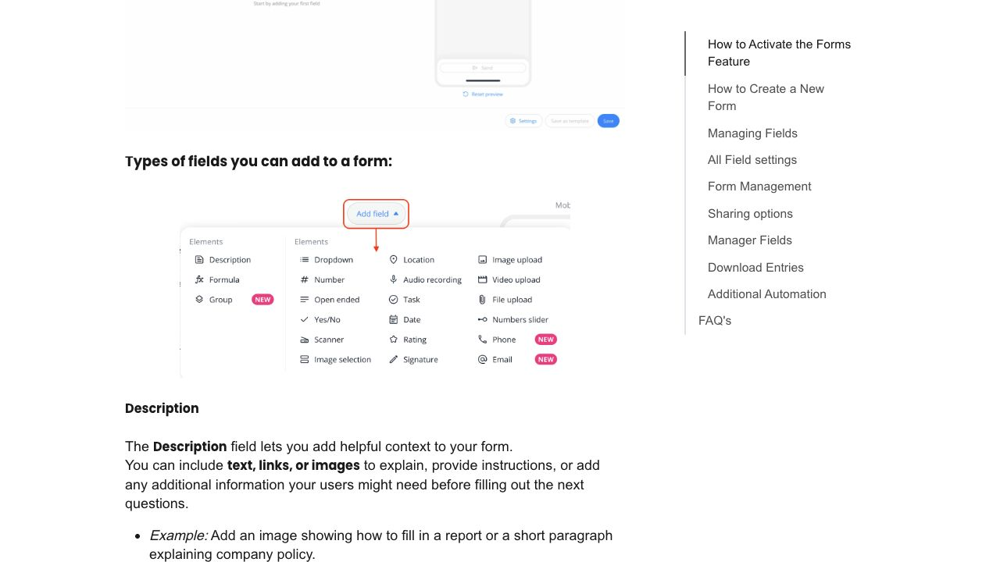

The expanded palette groups field choices in columns. The lesson is discoverable input types with
progressive disclosure; showing every possible type to a worker would add complexity. The illustration
filename is dated December 2025. [^3].

### V02 — Form administration

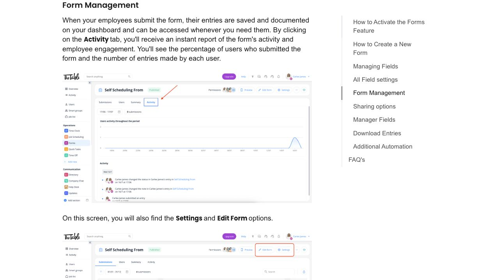

Activity, Users and Submissions are separate questions. For Vakhta, preserve a direct path from an
exception to its evidence and responsible person; avoid adding a chart without a decision it supports.
The embedded example is dated July 2025. [^3].

### V03 — Auto-assignment confirmation

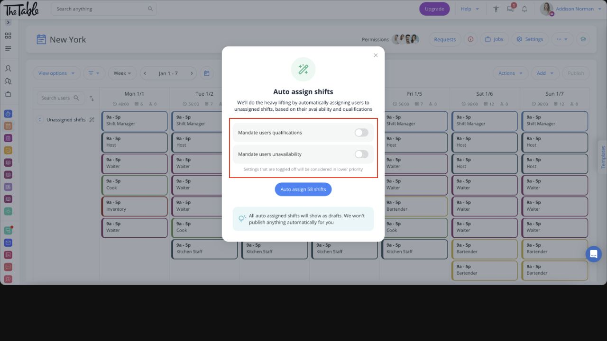

A centered confirmation dialog names the number of affected shifts and explains draft output. The
two rule switches expose an important policy choice. Reuse review-before-publication; mandatory work
authorization must not be silently softened. Screenshot date is not established. [^4].

### V04 — Bulk task entry

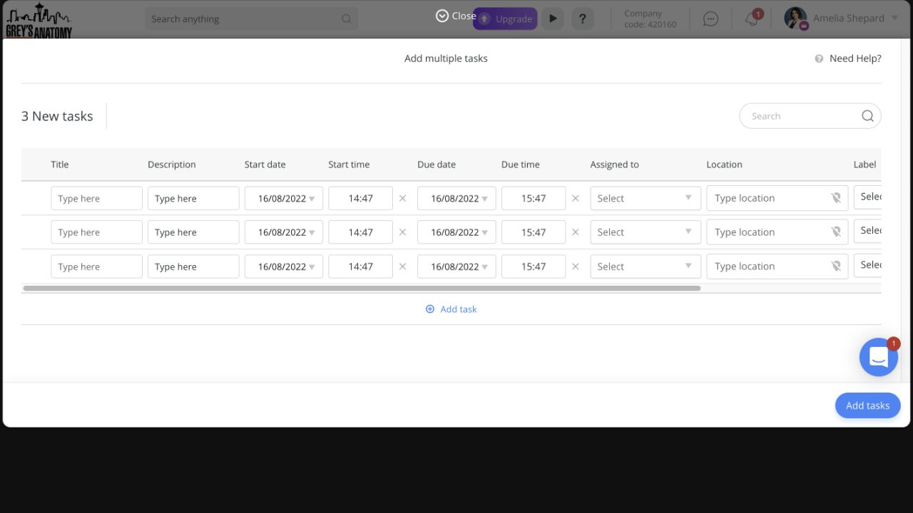

This August 2022 illustration shows parallel task entry and a horizontal scrollbar. It is a historical
example of dense desktop input, not proof of the current layout. Adopt explicit shared fields and
per-row errors where bulk entry is useful; provide a separate usable mobile sequence. [^5].

### V05 — Onboarding responsibilities

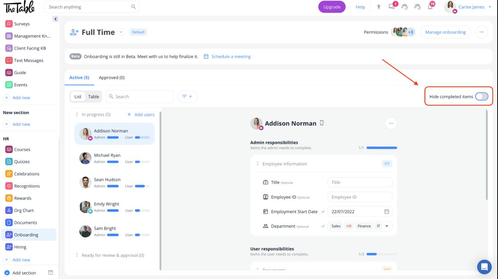

The February 2026 example combines an employee list, separate Admin/User responsibility progress and
a hide-completed control. It exposes who still needs to act. Vakhta should preserve that distinction
and show an explicit waiting-for-review state, while retaining completed evidence. [^6].

### V06 — Course catalogue

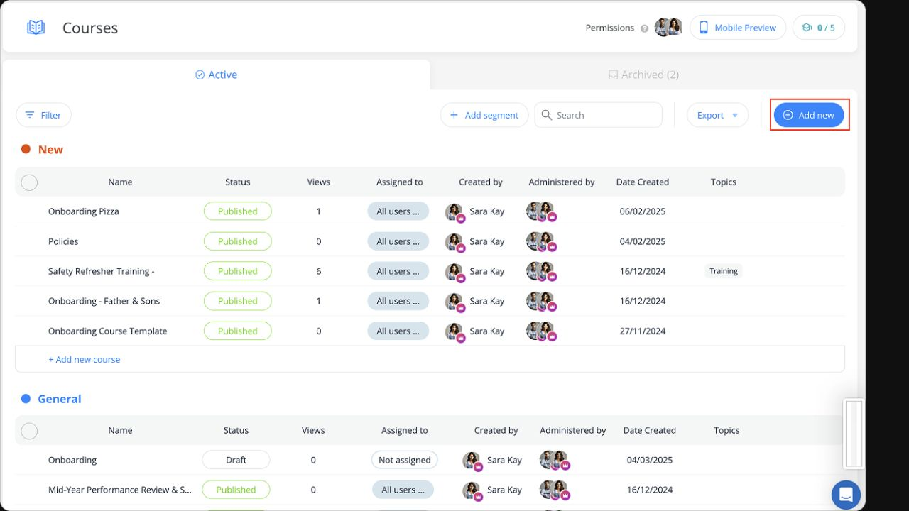

Grouped tables expose publication status and audience. Views sit alongside authors and permissions,
but a view is a weak learning signal. For Vakhta, foreground missing required material and next action;
retain catalog administration for authorized editors. Illustration date is unconfirmed. [^7].

### V07 — Course editor and mobile preview

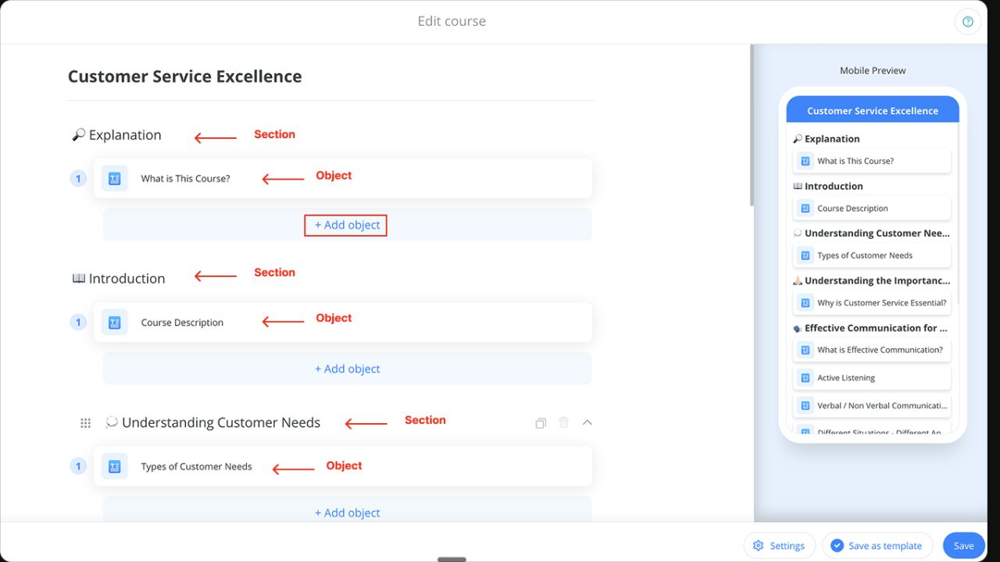

Section/object composition is visible beside a mobile outline. This helps identify long headings and
excessive depth before publication. For factory instructions, prefer short contextual steps and
approved examples over a large document tree. Illustration date is unconfirmed. [^7].

### V08 — Help-desk administration

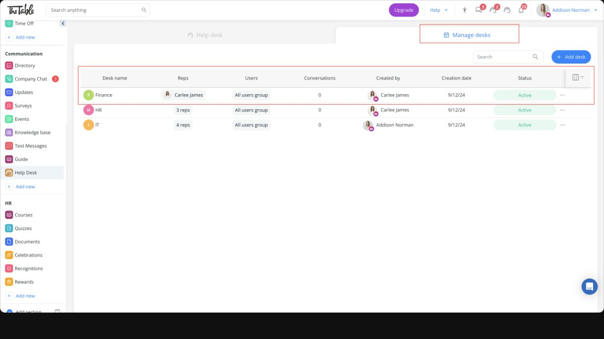

The September 2024 example exposes representatives, audience and status in one row. Reuse visible
responsibility and scope; a desk with several representatives does not itself identify the person
accountable for a particular production incident. [^8].

### V09 — Mobile update acknowledgment

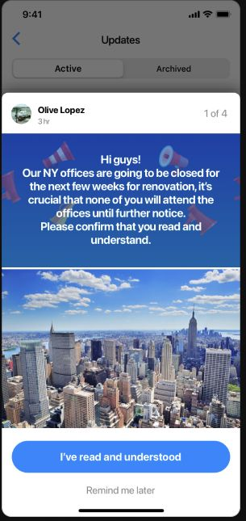

The narrow screen gives one prominent confirmation and a secondary defer action. The example's
decorative image consumes substantial reading space. Vakhta notices should prioritize changed
instructions and relevant evidence, with a clear distinction between acknowledgment and practical
competence. The article is dated June 2024. [^9].

## Complete capability analysis

The following 90 entries preserve CT identifiers used in GitHub. Behavioral descriptions are documented
unless explicitly identified as visual evidence. Borrow/defer recommendations are analytical proposals.

## Attendance and presence

### CT-01 — Clocking and current attendance

Employee opens Time Clock, starts a shift and selects the work resource; managers separate current operations from historical timesheets. The Today surface exposes running-late, clocked-in, overdue clock-out and leave states, with configurable columns. **Borrow:** organize the master's attention by exceptions with direct relevant actions. Do not equate a clock event with productivity. Standard mobile, kiosk, desktop and in-product NFC punches require connectivity. [^10], [^11], [^12].

### CT-02 — Jobs, projects and sub-jobs

Admins model resources and nested sub-resources; workers select qualified work. Sub-jobs inherit parent settings unless overridden. A parent with sub-jobs requires a specific sub-job during scheduling. Grouped/collapsed schedule views retain aggregated hours. **Borrow:** reuse zone/position context rather than asking workers to re-enter it. A generic client/project hierarchy adds little unless the factory genuinely allocates work that way. [^13], [^14].

### CT-03 — Breaks

Managers define centrally assigned break policies. Manual breaks may be paid/unpaid and recurring or threshold-triggered; automatic breaks deduct unpaid time after worked-hour thresholds. Separate display names simplify employee wording. **Critical:** activating automatic breaks applies retrospectively to past timesheets according to the guide. **Borrow:** clear break state and due prompts; preserve recorded intervals and separately approved policy changes. Payroll deductions are outside current Vakhta scope. [^15].

### CT-04 — Timesheet review and corrections

Employees review a period then explicitly submit it; submission time becomes visible. Editing an unlocked, unapproved timesheet invalidates submission and requires resubmission. Managers inspect conflicts and edit entries. **Borrow:** visibly invalidate acknowledgments when the underlying record materially changes; distinguish original worker confirmation from administrator correction. Connecteam's editing flexibility is not evidence of immutable event history. [^16], [^10].

### CT-05 — Shift notes and evidence

Admins configure text, dropdown, number, image/file and signature shift entries. Required entries prevent clock-out and highlight missing input; employees can copy an earlier entry that day or clear fields. **Borrow:** only context-specific required evidence; never copy photographs or attestations by default. Required shift entries are distinct from verifying that a separate linked form was completed. Two entries are documented at Advanced, unlimited at Expert. [^17], [^18].

### CT-06 — Shared kiosk

Admin provisions a named tablet/phone station, choosing full assigned tools or clock-only operation. Worker enters private four-digit PIN; clock-only mode confirms the punch then logs out. Optional selfie and timed inactivity logout exist. Portrait only; changing station mode requires reinstall. **Borrow:** unmistakable success and privacy reset; retain QR unless phone-free attendance is needed. Selfie is evidence capture, not demonstrated biometric identification. Selfie: Expert any hub; inactivity logout: Advanced any hub. [^19].

### CT-07 — Allowed attendance interfaces

Manager independently configures scheduled and unscheduled punches and allowed devices; timesheet editing is a separate permission. Kiosk-only hides clock-in elsewhere without necessarily hiding requests or historical timesheets. **Borrow:** explain exactly why an action is unavailable and preserve authorized correction routes. Documented settings include a contradictory toggle sentence, so do not reproduce its literal implementation semantics. [^20], [^21].

### CT-08 — GPS and geofences

Manager requires, permits or disables location and can exempt punch devices. Job/branch/site fences filter eligible jobs by location; jobs without fences remain unrestricted. The settings expose resources missing a fence. Outside-fence clock-out can route through an edited-time approval request. **Borrow:** a configuration coverage audit and explicit exceptions, if attendance policy expands. Indoor GPS uncertainty makes this a conditional factory feature. [^22], [^23].

### CT-09 — Movement and automatic clock-out

Breadcrumbs records movement while clocked in and presents individual trails to reduce map clutter; updates are typically 5–10 minutes and depend on service/movement. Separately, clock settings support shift-end/grace-period or daily-boundary closure; geofence exit can do nothing, remind or close. **Borrow:** clear provenance for estimated closure and recovery, not indoor movement tracking. An automatic close does not prove physical departure. [^24], [^25], [^23].

### CT-10 — NFC

Workers scan a site/job tag using their phone. Tag configuration restricts usable jobs; timesheet hover identifies tag name. A tag's stored location can replace live GPS for fence validation. Different-device clock-out requires approval by default. Metal mounting can interfere. **Borrow:** possible low-friction alternative only after observing QR problems; test factory hardware first. This is not necessarily an employee badge reader. In-product NFC still needs internet; Basic Operations is documented. [^26].

## Timesheets and payroll

### CT-11 — Review periods, locks and approval

Admin defines pay-cycle dates and reminders; individual days, employee timesheets and whole exported periods have distinct controls. Approval and reopening permissions are separate. Owners are exempt from optional self-approval restrictions. A locked current day can prevent clock-in. **Borrow:** explicit finalized/reopened states and reasons for corrections; never accidentally block presence through historical review. Keep bonus finalization distinct from a future payroll module. [^27], [^28].

### CT-12 — Rates and overtime

Admins set employee rates and effective dates on desktop; assigned policies determine overtime and special compensation. Separate columns and hover explanations expose which rule applied. Current rule types include overtime, standalone special rate, additional rate, flat pay and premium. **Borrow:** explain calculations and policy versions in existing bonus/OT review. Full wage calculation requires a separate decision; vendor regional examples are not Ukrainian legal validation. [^29], [^30].

### CT-13 — Exports

Manager chooses totals, daily timesheets or per-shift reports; per-shift exports avoid splitting overnight work into misleading daily fragments. Export configuration includes identifying fields, punch device, job codes and selected attachments. **Borrow:** make period, timezone, units and inclusion rules explicit; reconcile exports with the displayed filtered scope. Do not present labor-cost reporting as already part of Vakhta. [^31], [^32].

### CT-14 — Scheduled report delivery

Manager activates a report template or creates one, choosing timing, recipients and content in Time Clock settings. This reduces repeated export work but introduces a second distribution surface. **Borrow conditionally:** one scoped digest for an established recurring review, with freshness and delivery status; avoid sending every detail to everyone. Verify recipient authorization at send time. [^33].

### CT-15 — Payroll/payslip integrations

Connecteam documents named payroll, employee-sync, POS and payslip connectors separately, plus export templates and API/webhooks. Coverage differs by provider and region; a payroll connector does not imply a corresponding payslip feature. **Defer:** select an actual factory accounting system and reconciliation contract first. No inspected source establishes a ready Ukrainian payroll adapter. [^34].

## Scheduling and staffing

### CT-16 — Calendar and publication

Planner works in day/week/month views organized by workers, jobs or layers; creates individual/bulk shifts as drafts or publishes immediately. Unassigned drafts sit at the top. Separate schedule and employee-scope administration governs editing. **Borrow:** preserve draft/published distinction and let one view answer one planning question. Vakhta already has calendar and versioned publication; improve clarity rather than duplicate navigation. [^35].

### CT-17 — Recurrence and templates

Planner sets daily/weekly/monthly recurrence, interval, weekdays or ordinal monthly dates. Saved shift and weekly templates reduce repetition. **Borrow:** explicit series membership, termination and occurrence-level exceptions; preserve changes in already published/history periods. Do not replace useful factory rotation patterns with a more generic recurrence editor just for parity. [^36], [^35].

### CT-18 — Bulk changes and import

Planner selects days/workers/jobs and applies explicit field changes, assignment addition/replacement, publication or duplication. Import downloads a template, maps identifiers and unknown columns, previews records, confirms, then publishes drafts. Unknown jobs require reconciliation rather than silent creation. **Borrow:** impact preview, explicit add-versus-replace and unresolved rows. CSV import is Basic Operations; scope it only if factory planners maintain external rosters. [^37], [^38].

### CT-19 — Context-rich shifts

Shift details carry location, instructions, files and tasks; resource metadata can populate context. Internal shortcuts link relevant assets. **Borrow:** position/zone-specific SOP links and evidence examples at the moment of work. Avoid turning every shift into a long form. Preserve existing domain fields rather than a generic custom-field platform until repeated needs appear. [^35], [^39].

### CT-20 — Confirmation and sharing

Workers confirm/reject with optional note; admins see status dots and may change status themselves. Settings can require opening shift details first. External sharing exposes filtered published/assigned shifts through an owner-created bearer link; only weekly user view is documented, and recipients must refresh. **Borrow:** acknowledgment origin/time and changed-version invalidation. Public links are low priority. Advanced includes sharing; Expert permits up to six links. [^40], [^41].

### CT-21 — Open shift claims

Planner publishes a shift with a count of available places; qualified workers claim. First-come assignment is the default, with optional manager approval and overlap prevention. Remaining places appear as a number on the shift. Approval history is accessible through Requests. **Borrow conditionally:** offer eligible replacements for a known shortage; acceptance must atomically recheck capacity and eligibility. Manager approval is Advanced Operations. [^42].

### CT-22 — Replacement and availability

Workers record unavailable/preferred hours; unmarked time means available. Planners see red/green context and preference-ranked candidates. Replacement requests can require manager approval, visible at the shift and request queue. **Borrow:** distinguish absence, preference and actual commitment; preserve the current consent-based swap process. Documentation differs on bulk deletion of repeated availability, so verify before borrowing exact behavior. [^43], [^44], [^45].

### CT-23 — Qualifications

Admin selects qualified users/SmartGroups per job; sub-jobs inherit or override eligibility. Workers only see permitted jobs when clocking. **Borrow:** an explicit authorized eligibility record by position/zone, with source and effective/expiry dates where needed. The inspected article describes allow-lists, not a proven automatic certification-expiry engine. Do not infer legal authorization from a quiz result or profile label. [^46].

### CT-24 — Conflicts and work rules

The Issues surface brings overlaps, unavailable workers, rejected/unassigned shifts and replacement requests together. Policies warn about hour/shift/rest constraints; optional restrictions block employee claims. Rule setup links from publishing reduce context switching. **Borrow:** missing coverage and explainable eligibility before optimization. Distinguish headcount demand from maximum-hours rules. Main guide's per-user-policy text contradicts its old schedule-wide-only FAQ; exact limitations need trial validation. [^47], [^48].

### CT-25 — Auto-assignment

Planner first creates unassigned shifts and rules, then runs assignment. It considers overlap, approved absence, availability, qualification, coverage and fairness; preferences are subordinate. Results remain drafts; unresolved shifts remain unassigned; Undo/Reshuffle are available. Qualification/availability consideration can be relaxed by toggles. **Borrow later:** bounded proposals with explanations and human publication; never allow mandatory safety eligibility to become a soft preference. No optimum or complete-coverage guarantee is documented. [^4].

## Forms and review

### CT-26 — Builder/templates

Admin starts blank, from a template or file; fields are edited with a mobile preview, then audience and publication timing are chosen. Draft saving precedes worker visibility. **Borrow:** preview the actual worker journey and immutable versions. Extend existing checklists for demonstrated needs before building general low-code tooling. Reusable saved form templates are documented from Advanced. [^3].

### CT-27 — Field types

Forms combine descriptive content, choices, numeric/media/signature/location inputs and grouped questions. Camera-only versus gallery sources and multiple-upload settings are configurable. **Borrow:** short choice/number answers and example photos when they remove transcription; units, validation and media provenance must remain explicit. Camera-only is not proof that a scene is genuine. [^3].

### CT-28 — Required and conditional questions

Admin adds show-if conditions with AND/OR, testing branches in a resettable preview. Rearranging fields can invalidate conditions and trigger a warning. Required visible fields prevent submission. **Borrow:** ask follow-ups only for exceptions; reject broken references before publication and preserve hidden-answer semantics explicitly. Conditional fields are Advanced. Do not emulate fragile positional dependencies when stable question IDs exist. [^49].

### CT-29 — Formulas

Admin composes a formula from numeric, slider, rating or other formula answers; result columns and hover details appear in entries and summaries. **Borrow conditionally:** deterministic calculations for a proven repeated process, with explicit units and missing-value behavior. The guide's mileage example incorrectly shows addition; do not copy its arithmetic. Formula fields are Advanced Operations. [^50].

### CT-30 — Voice and file conversion

Admin enables speech-to-text on open-ended mobile fields; worker dictates text. Separately, uploaded documents become editable draft forms before saving. Voice is Expert; file-to-form guide says Advanced, while broader pricing references have differed. **Borrow later:** editable transcription if factory noise/language trials show value. Document-to-form generation is not workplace-photo defect detection and does not replace human schema review. [^51], [^52].

### CT-31 — Submission review surfaces

Manager filters submitted/non-submitted workers and reviews entries in a table or inbox. Inbox uses a list alongside detailed content, emphasizing status; table groups by status, date, fields or user attributes. Access is restricted to managed employee groups. **Borrow:** focused review queue and useful filters. Keep Vakhta's accepted expanded-row reading surface rather than copying an inbox layout mechanically. [^53].

### CT-32 — Manager decisions and fields

Managers attach status, notes, assigned person, date, signature or file after submission; configuration controls editing and employee visibility. Multiple status columns can represent multiple reviewers, but this does not prove ordered transactional approval. **Borrow:** one accountable reviewer, explicit decision and preserved evidence; keep operational state transitions in domain logic. A blue dot documents an admin filling an initially blank answer, not necessarily a complete revision ledger. [^54], [^53].

### CT-33 — Routing and sharing

Admin can auto-send every entry, conditionally route matching entries, present a predefined recipient list or allow typed external email after submission. Recipient selection may be mandatory. Conditional auto-share is Expert. **Borrow:** deterministic routing by incident category/zone with scoped recipients; avoid arbitrary worker-entered email for factory evidence unless required. Sending an entry is not proof that a responsible person acted. [^55].

### CT-34 — Reminders and limits

Only non-submitters receive configured first/second reminders; tapping goes directly to the form. Limits may be total/per-user, reset periodically, restrict weekdays or close at a deadline. Global cap keeps a form visible but blocks submission; per-user cap can hide it. **Borrow:** suppress obsolete reminders and explain blocked/completed state instead of disappearing content. Advanced includes reminders/day restrictions; periodic limit resets are Expert. [^56], [^57].

### CT-35 — Evidence export and summaries

Manager selects entries for separate/unified PDFs or attachments; larger PDF selections are prepared asynchronously and emailed, with a documented 100-entry selection cap. Scheduled reports choose entries or non-submitting users, filters, recipients, fields and whether empty periods send. **Borrow conditionally:** explicit preparation status, selected scope and expiring access. Bulk operations are Advanced; form auto-reports are documented from Expert. [^58], [^59].

## Tasks

### CT-36 — Ad hoc assignment

Creator supplies title, context, location, start/deadline and assignee, then publishes. Task start uses account timezone. Single-task creation is available on all plans; bulk creation starts at Advanced. **Borrow soon:** turn an existing incident or handover finding into one linked corrective action with an accountable owner and deadline, reusing evidence. Avoid forcing reporters to maintain a second unrelated record. [^5].

### CT-37 — Group versus individual work

A group task has shared assignees and any member can complete it; all see the completing person. Separate-task mode instead creates individual obligations. Admin changes/restoration/deletion notify assignees. **Borrow carefully:** make ownership/completion semantics explicit; corrective actions should initially have one accountable owner. Team visibility can coexist with individual responsibility. [^60], [^61].

### CT-38 — Subtasks and collaboration

Task details supply instructions and media; comments support evidence, mentions and replies. Subtasks show execution progress. Expert shortcuts can open other assets. **Borrow:** one task-linked evidence/history thread and only meaningful subtasks. Existing incident evidence should remain the original record; do not duplicate attachments or require a corporate chat module. Documented task completion alone is not proof of manager acceptance. [^62].

### CT-39 — Recurring tasks

Creator defines start, daily/weekly/monthly cadence, due time and termination date/count. Repeat icon marks series. Detail edits choose this occurrence or future tasks; frequency changes warn that the occurrence becomes unlinked. **Borrow after one-off tasks:** explicit occurrence identity, cancellation and future-only edits so completed evidence survives recurrence changes. Recurrence is Advanced Operations. [^63].

### CT-40 — Progress and shift tasks

Quick Tasks offers labels, date/list grouping, overdue queue and reminders. Shift Tasks instead remain attached to a scheduled shift and its reusable template. **Borrow:** one overdue operational queue, with a clear difference between a required handover checklist and a corrective action that may outlive the shift. Export details require a narrower source check before promising parity. [^61], [^64].

## Communications

### CT-41 — Private, team and broadcast communication

Admins/users create a conversation or a group; groups can prohibit member replies. Smart Group membership propagates into chat membership. Broadcast sends separate private conversations, now selectable by currently working/running late status. This is useful for relevant operational notices; a complete competing messenger has low initial value for Vakhta. [^65]

### CT-42 — Media, polls and read evidence

Participants attach media and answer embedded polls. Poll controls include multiple choice, anonymous voting and hiding results until voting. Group read status opens a recipient list; individual messages display read checks. For manufacturing, keep transport success, viewing and explicit acknowledgment distinct. Read status cannot establish comprehension or execution. [^66], [^65]

### CT-43 — Scheduled messages and saved context

An admin writes now and selects a delivery time; private messages additionally support next clock-in. Each conversation exposes its pending messages, with send-now, reschedule and deletion controls. Sender timezone applies; unfinished rescheduling does not stop the original send. Useful adaptation: nonurgent notices at the worker's next relevant shift. Star/pin wording differs between current guides; verify exact behavior in an account. [^67], [^66]

### CT-44 — Communication permissions

Owners configure desktop chat settings for permitted contacts, direct-manager-only initiation, exclusions and group creation. Admin restrictions depend on employee restrictions. Internal peer communication can be disabled while operational notifications, AI and Help Desk continue. Manufacturing lesson: separate required operational channels from optional social communication; avoid hidden policy dependencies in Vakhta. [^68]

### CT-45 — Translation and transcripts

Users translate a message in place and can restore the original; desktop uses hover controls, mobile long-press. Voice messages can be transcribed. Translation language follows account/device settings respectively. This can help noisy multilingual workplaces, but safety instructions require controlled translations and original access. Translation is documented under Communications Expert; advanced settings apply globally rather than per conversation. [^69], [^70]

### CT-46 — Announcement feed

Admins compose and publish rich updates to a selected audience. Feed content supports attachments, reactions and discussion, with search by title, archive and restore. This gives durable notices a distinct home from transient chat. For Vakhta, a concise operational notice list would be more useful initially than an engagement feed. [^71]

### CT-47 — Acknowledgment and follow-up

Admins configure a pop-up and confirmation label, inspect who confirmed and remind remaining recipients. Workers can choose Remind Me Later; pop-ups recur on app entry until confirmation or configured expiry, while the feed item remains. This is a useful delivery pattern, but neither a hard prerequisite nor proof of understanding. Vakhta should bind acknowledgment to the exact instruction revision. [^9]

### CT-48 — Scheduled and targeted publications

Admins select daily/weekly/monthly recurrence and an end date; the Scheduled tab distinguishes future publications, with deletion of one occurrence or the remaining series. Owners organize feed topics; recipients browse horizontal categories. Useful for planned production changes, but repetitive unchanged reminders risk habituation. Prefer event/revision-based notices over daily compulsory re-confirmation. [^72], [^73]

### CT-49 — Surveys and live polls

Admins create questionnaires with dropdown, open text and rating fields, assign users/groups, and optionally mark the survey anonymous. Mobile notifications deep-link to the questionnaire; anonymous entries omit identifying profile fields. This can surface repeated worker friction, but small-group comments can still identify people. Polls are for lightweight feedback, not incident tracking or verified training. [^74], [^75], [^76]

### CT-50 — Events and RSVP

Desktop admins publish an event with timezone, location, registration deadline, capacity and allowed responses; mobile workers respond, add it to their calendar and discuss details. Registration reminders and limited-capacity notifications are configurable. Useful for scheduled classroom training, but RSVP is intent rather than attendance or qualification evidence. Mobile event creation is explicitly unavailable. [^77], [^78]

## Directory and internal service requests

### CT-51 — Employee directory

Workers search a common company phone book and open contact actions. Activating the directory exposes the feature to all users, while settings determine visible people and fields. A small role-based contact surface could remove uncertainty about whom to contact during a shift; broad access to personal records is unnecessary. [^79]

### CT-52 — External work contacts

Admins add suppliers, emergency numbers or reception under Work Contacts; these entries do not create app accounts. Mobile displays work contacts before employees and offers calling. Manufacturing value is conditional: a curated escalation/contact card may be sufficient. Hidden-contact controls are plan dependent; a contact entry is not authorization to access systems. [^80]

### CT-53 — Visibility controls

Admins can hide individual employees or fields and restrict visibility using shared profile values or selected exceptions. The settings include a mobile preview. This is an instructive permission-design pattern: show the expected audience before saving. Vakhta should retain server-enforced role/site scope; directory visibility must not become the security boundary for personnel data. [^79]

### CT-54 — Department Help Desks

Administrators create topical desks and assign representatives and eligible employees; employees choose the appropriate destination instead of guessing a person. This is valuable where HR/IT requests repeatedly reach the wrong master. Vakhta should first improve its existing structured request routing before introducing another request container. [^81]

### CT-55 — Assignment and query lifecycle

Representatives use Unassigned, Assigned and All views. The first reply claims a query; becoming unavailable returns assigned conversations to the shared queue. Replies to individual broadcast messages become separate queries. This gives visible ownership, but urgency priorities are explicitly unsupported; pinning is suggested instead. Production incidents need severity, acknowledgment deadlines and accountable handoff beyond this help-desk model. [^82], [^83]

## Knowledge and company AI

### CT-56 — Company instructions and resources

Admins build section/subfolder libraries with text, links and files; readers navigate or search. Inline empty-folder creation controls and reordering reduce setup friction. Spreadsheets must be downloaded rather than read/edited in-app. Manufacturing value is high for short, illustrated SOPs, but deeply nested folders and desktop documents would increase worker search effort. [^84]

### CT-57 — Assigned knowledge

Content and administrative permissions can be scoped; Smart Groups automatically distribute resources as profile membership changes. Admin controls distinguish viewing, editing and creation. Adaptation: role/zone-relevant instructions with a preview of affected workers. Before specification, decide whether assignment is a live audience or a historical publication snapshot; those support different audit questions. [^85], [^86]

### CT-58 — Search and readership analytics

Readers search keywords. Administrators inspect views at knowledge-base, folder and file level, then filter recipients and send reminders or create tasks. Counts and last-viewed dates indicate access, not acceptance of a specific revision. Vakhta should distinguish retrieval analytics from an acknowledgment ledger and measure repeated questions rather than maximize clicks. [^84], [^87]

### CT-59 — Resource-grounded AI

Admins choose knowledge sources and response instructions; workers ask questions in Chat and can open View sources. Supported sources include uploaded files and public pages; authenticated URLs and external file URLs are unsupported. High-value adaptation: answer from approved current SOPs with citations and escalation when unsupported. An instruction prompt is not a permission system or accuracy guarantee. [^88]

### CT-60 — Multiple agents and knowledge updates

Admins assign agents to users/groups, change sources/instructions, inspect usage and deactivate agents. Knowledge edits automatically update agent knowledge; the guide states up to 20 agents on Communications Expert. For Vakhta, start with one clearly bounded assistant. Resource freshness, removal propagation and cross-user authorization need independent tests; multiple personas do not solve those risks. [^88]

## Training and competency

### CT-61 — Mixed-media courses

Training owners compose sections containing text, videos, documents, forms and quizzes, save a draft, then publish to relevant workers. A direct course link opens the assigned course for a logged-in employee. High manufacturing value for repeatable introductions, provided short steps complement supervised practical instruction instead of replacing it. [^7]

### CT-62 — Ordered release and deadlines

Course settings separate general due dates from object timing. Objects/sections may appear after the preceding material or on a specified date. This supports progressive onboarding and refresher programs. Vakhta needs visible blocked reasons, assignment-relative deadlines where relevant, and a clear distinction between optional reading and a required prerequisite. [^89]

### CT-63 — Completion and progress

Managers see not-started/in-progress/completed summaries and a detailed section matrix; they can filter, export and initiate follow-up. Authorized admins may manually change completion, including classroom training. Unskippable video/read confirmation is documented. Adaptation: record evidence source, assessor, date and revision; watching a video or administrative completion must not automatically authorize hazardous work. [^90], [^91]

### CT-64 — Quizzes and results

Admins create single-answer multiple-choice questions, configure pass score, feedback, question order, attempt limit and deadline, and preview mobile presentation. Employees can pass a quiz once; repetition uses course timing. For manufacturing, short scenario questions can identify misunderstanding, but the documented quiz cannot represent a full practical competency assessment. [^92]

### CT-65 — Course templates and AI generation

Authors choose a template or generate a sectioned draft from a prompt, then edit and publish. Reusable templates reduce repeated authoring; saved-template quotas are cross-feature rather than independent per module. For Vakhta, first collect approved factory material. AI-generated procedure text needs expert review and controlled publication; generation speed is not training quality. [^7], [^93]

## Employee documents and permissions

### CT-66 — Document packs and uploads

Administrators assign bundles of required personnel documents; workers upload them, and admins can upload on their behalf. Profile and document-module entry points show the same packs. Useful for certificates without requiring a full HR suite. Separate protected source files from the minimum qualification status a production planner needs. [^94]

### CT-67 — Review and missing evidence

Admins see pending, approved and missing documents and may request replacement or review a submission. Permissions distinguish view/download, upload, approve/reject and edit per pack. New packs initially inherit feature admins. Vakhta should default sensitive evidence narrowly, show who can review it, and keep replacement history instead of silently overwriting an authorization basis. [^95], [^94]

### CT-68 — Expiry and renewal

Expiry can apply to a document type or an individual upload. Admins filter expired/near-expiry records; notifications go 30, 7 and 1 day before expiry and on expiry. Early replacement does not bypass a shared type expiry. High-value adaptation: qualification validity, renewal evidence and human approval. Expiry notification alone does not prove automatic staffing exclusion. [^96]

### CT-69 — PDF completion and signing

Admins place fields on a PDF; profile-linked fields prefill, and workers complete required fields, review and submit. Common and per-worker documents are supported; uploads have a 30-page limit. This reduces re-entry, but signature collection should remain a separately scoped need. The source does not establish Ukrainian qualified electronic-signature compatibility. [^97]

### CT-70 — Multiple signers and sequence

Authors assign document fields to the employee, manager or another user and order signers; employee completion precedes subsequent review when configured. Useful for formal approval chains, but not required for an ordinary SOP acknowledgment. The inspected signing guide verifies sequencing, not a detailed cryptographic audit certificate or jurisdictional legal equivalence; narrow the old inventory's generic “audit” wording. [^97]

## Leave and absence

### CT-71 — Policy-based requests

HR admins define paid/unpaid policies; employees request time against assigned rules. Hours/days and approval are explicit settings. Keep a simple factory request path and show operational absence without medical reasons. An entitlement engine needs a real HR owner. [^98]

### CT-72 — Approval with balance visibility

Managers review requests or add absence; the interface previews duration and resulting balance. Opening balances are entered per employee. This makes consequences reviewable before approval. Extend Vakhta approvals with balances only after establishing authoritative starting data and adjustment ownership. [^98]

### CT-73 — Accrual and tenure

Admins configure fixed or hours-based accrual and tenure rates; previews expose future accrual. Timesheets and break policy affect calculations. Overnight factory shifts complicate the meaning of days. This requires a separate HR/payroll specification. [^98]

### CT-74 — Entitlement limits

Admins configure carryover, balance/usage limits and notice/duration rules; invalid requests show validation. Explain which rule blocks submission. Policy choices require business ownership: configurable limits do not establish local legal compliance, and foreign default workweeks are unsuitable assumptions. [^98]

### CT-75 — Evidence, history and exports

Administrators export daily approved leave or totals per employee/policy; hours and days remain separate columns. A user balance-log export contains accruals, adjustments, leave and carryover matching current filters/visible columns. Useful adaptation: explicit export scope and units, with restricted medical attachments. Preserve absence projection and correction history before adding entitlement accounting. [^99]

## Hiring and onboarding

### CT-76 — Vacancy applications

Recruiters configure a position, application fields and upload requests, then enable a public link. Applicants submit outside the employee account flow; staff can add candidates manually. Useful if hiring is a repeated bottleneck, but it creates separate applicant privacy and lifecycle requirements. The basic operational product should not absorb an unowned recruitment pipeline. [^100]

### CT-77 — Hiring stages

Recruiters arrange stages and move candidates forward, reject with a reason, add notes or reopen earlier stages. The stage view includes time spent waiting. Borrow the visible waiting/ownership pattern for operational queues. Hiring decisions remain human; candidate status and employee status must remain separate. [^100]

### CT-78 — Applicant-to-employee conversion

Field mapping carries application/profile/document data into the employee record. The final review asks for missing required details and policies before invitation. This avoids re-entry, but conversion must not automatically establish work qualifications. Position limits vary by plan; this capability has conditional value until Vakhta has a real recruitment workflow. [^100]

### CT-79 — Onboarding packs

Admins bundle employee/admin fields, documents, policies and tasks, with required/optional items. Task deadlines count from pack assignment. Workers see a completion widget while administrators see their own responsibilities. A factory starter pack could link instructions, practical checks and identity setup; US government forms in the vendor product are not reusable Ukrainian requirements. [^6]

### CT-80 — Completion and reopening

List/table views expose missing items; authorized staff review and approve a completed pack, with explicit reopening available. The documented worker widget can remain incomplete because of a hidden admin-only field. Vakhta should avoid that failure: explain “waiting for supervisor” and provide distinct worker-complete, admin-pending and approved states. [^6]

## Organization and platform

### CT-81 — Profiles and rule-based audiences

Owners/admins define profile fields, tags and Smart Group rules. Membership changes automatically add/remove feature access; multiple criteria can combine. Filters are case-sensitive, so dropdowns are recommended. Useful adaptation: reuse Vakhta's canonical position/site/zone IDs and preview membership. Avoid editable text tags silently becoming safety qualifications or permissions. [^86]

### CT-82 — Organization chart

The chart derives from direct-manager relationships; setup prompts for missing managers. Cards expose role and direct/indirect reports with configurable fields. This may help large-factory onboarding but is secondary to accurate responsibility routing. Critical caveat: assigned chart admins can see all users regardless of other admin permissions; do not copy that scope bypass into Vakhta. [^101]

### CT-83 — Employee timeline

Profile changes, pay/rule changes and manually entered milestones appear as a filtered chronological view with type icons/colors. Each automatic event records actor/time/change. Useful as a readable history projection, but not a substitute for append-only audit. Separate operational evidence from evaluative HR notes and enforce field-level access. [^102]

### CT-84 — Recognition and rewards

Managers award badges or funded tokens, with permissions controlling budgets and sending. Workers can redeem tokens through a gift-card catalogue. This is a separate financial/rewards workflow, not simply another score display. Vakhta already has operational recognition; defer redemption, celebration feeds and new incentive mechanics pending an explicit objective and regional availability check. [^103], [^104]

### CT-85 — Administration and security

Mobile admin tools expose operational actions, while some setup remains desktop-only. Enterprise documentation lists SSO/2FA and administrative specialization; activity reporting records selected platform events. Manufacturing lesson: offer focused on-shift decisions with clear scope, not every setting on a phone. Branding, retention and security guarantees need plan-specific verification; this research did not run an account security audit. [^105], [^104], [^106]

## Automations, AI productivity and integration

### CT-86 — Trigger/action workflows

Owners/admins connect events to configured actions and choose draft or activation. Examples span forms, schedules, courses and documents. Admins see their own automations; owners see all. Valuable principle: make a handoff explicit. Vakhta should complete existing deterministic notification paths before offering a generic builder. [^107]

### CT-87 — Conditions, delays and execution visibility

Builders support conditions/delays, templates and AI-generated drafts with human review; a run log distinguishes success/failure. Advanced availability and Expert multi-step conditions are hub dependent; rollout remains Beta. Do not copy AI conditions for safety, pay or authorization. An execution log is not independent evidence that the worker saw a message. [^107]

### CT-88 — Escalation channels and NFC

Automations can send chat/SMS/email or scripted calls, with up to three unanswered-call retries and SMS-wallet charging. NFC can trigger configured workflows. Vakhta's useful first step is traceable recipient selection, delivery, acknowledgment and fallback using existing Telegram. No general retry/idempotency guarantee is established by these help pages. [^107], [^108]

### CT-89 — AI drafting and generation

Documented tools help create courses/forms, translate and draft operational content. These are authoring shortcuts, distinct from answering from approved knowledge or inspecting workplace photos. For Vakhta, draft status, provenance, reviewer and published revision matter more than adding a generic AI button; generated safety content must not self-publish. [^109], [^7]

### CT-90 — APIs and integrations

Admins configure keys/webhooks or supported integrations; OAuth is also documented. API access is hub-specific Expert+, with a legacy Enterprise exception. The access table still marks Courses/Documents as coming soon, so “has an API” does not mean all modules are accessible. Payroll, POS and HR adapters have specific systems/regions; no Ukrainian ERP compatibility was established. [^110], [^34]

## Vakhta baseline and integration boundaries

The following runtime boundaries were rechecked against source baseline
`f66cafc7f78b84d7482bb7ec8d19eaa09c947a91` on 2026-09-13. The separate calendar redesign has concurrent
uncommitted work; it is not counted as shipped. The earlier 90-row implementation matrix remains a
dated inventory and should be read together with these targeted checks. No deployment or production
employee action was performed for this assessment.

| Area                      | Rechecked current evidence                                                                                                                                                                                                                                                                            | Adoption consequence                                                                                                                                    |
| ------------------------- | ----------------------------------------------------------------------------------------------------------------------------------------------------------------------------------------------------------------------------------------------------------------------------------------------------- | ------------------------------------------------------------------------------------------------------------------------------------------------------- |
| Shift and handover        | [Checklist types](../../packages/domain/src/handover/checklist.ts) remain CHECK/NOTE/PHOTO. [Handover submission](../../apps/api/src/handover/handover.service.ts) validates completeness and routes decisions to the master.                                                                         | Extend the existing versioned workflow; do not add a parallel form submission/approval engine.                                                          |
| Notifications             | [Outbox schema](../../packages/db/src/schema/notifications.ts) has PENDING/SENT/FAILED/SKIPPED. [Individual messages](../../apps/api/src/identity/employees.service.ts) enqueue inside a transaction.                                                                                                 | Reuse delivery infrastructure but introduce explicit business acknowledgment separately.                                                                |
| Incident escalation       | [SLA timer](../../apps/worker/src/timers/incident-sla.ts) persists an escalation event. [Shift effect handler](../../apps/api/src/shift/shift.service.ts) exposes some master effects through the panel. Runtime references did not reveal an outbound consumer for those incident escalation events. | Verify event-to-recipient delivery as a source-identified gap; this is not proof of a live missed notice.                                               |
| Schedule acknowledgment   | [Schedule service](../../apps/api/src/scheduling/schedule.service.ts) already implements acknowledgment, status and reminder operations; [records](../../packages/db/src/schema/scheduling.ts) refer to assignments/versions.                                                                         | Keep #7 as the implementation owner. Clarify origin and freshness without building another acknowledgment system for schedules.                         |
| Knowledge AI              | [Support service](../../apps/api/src/support/support.service.ts) excludes live shifts, scores and employee data. [Knowledge loader](../../apps/api/src/support/knowledge.service.ts) reads repository product materials.                                                                              | A company SOP library and operational agent are new capabilities. Preserve the current product-help boundary; reuse AI Master for operational evidence. |
| People and qualifications | [Identity schema](../../packages/db/src/schema/identity.ts) has employees and structural assignments. Focused schema/runtime searches found no course/qualification/expiry/onboarding entities beyond unrelated token expiration.                                                                     | Propose new evidence contracts; do not describe organizational position as verified competence.                                                         |
| Corrective work           | Existing incidents, handover findings and structured requests contain evidence and routing. Infrastructure background tasks are execution jobs, not employee tasks.                                                                                                                                   | #43 should own a linked corrective-action lifecycle that reuses source evidence.                                                                        |
| Access                    | [Role grants](../../packages/domain/src/access/roles.ts) cover enterprise/site/unit/team/zone scope.                                                                                                                                                                                                  | Dynamic audiences select recipients; they must never replace server-enforced grants.                                                                    |

## Proposed operational contracts

These diagrams describe recommended Vakhta boundaries, not Connecteam internal architecture.

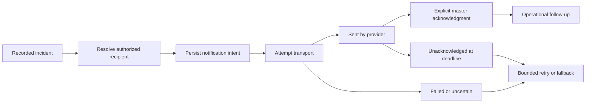

A durable event proves that an incident was recorded. It does not prove external delivery, viewing,
acknowledgment or resolution. The UI should make each fact independently visible and suppress obsolete
reminders after a resolution or recipient change. The fallback must name a responsible role; it cannot
be an anonymous “notification failed” status with no next action.

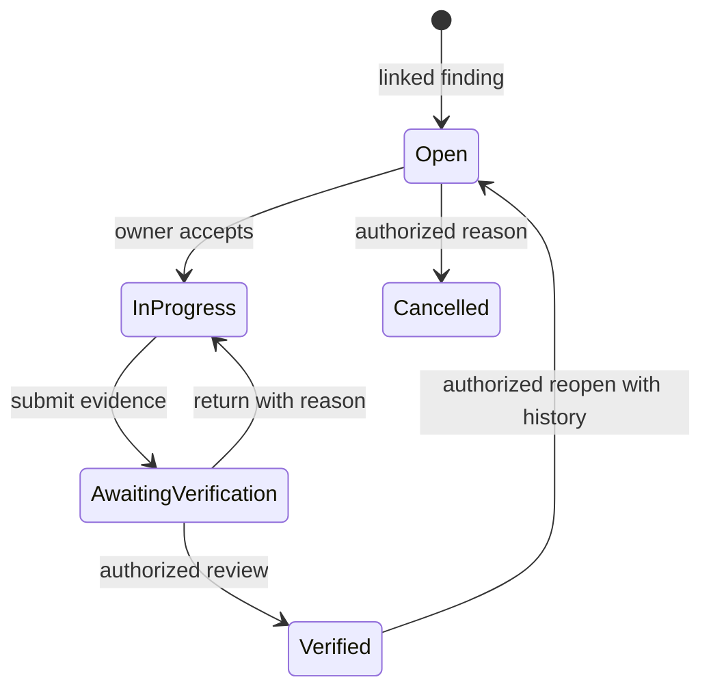

This is a candidate lifecycle for corrective actions. Whether every action needs independent
verification is an unresolved operating policy; the implementation must not invent that burden.
The record should retain one accountable owner even when several people help. A shift ending must not
silently close unresolved corrective work, and closing work must not rewrite the original incident.

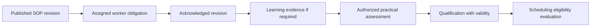

Each arrow represents a distinct, policy-defined relationship. A read receipt, quiz or AI answer must
not silently create qualification. Changes to instruction revision, role or validity can require new
evidence; historical records retain the revision and assessor that supported the original decision.

## Adoption decisions and GitHub ownership

“Prioritize” means advance a bounded requirement/pilot, not start implementation automatically.
No numerical savings, dates, assignees or accepted commercial prices are invented.

| CT IDs / GitHub | Recommendation            | Small useful adaptation and boundary                                                                                         |
| --------------- | ------------------------- | ---------------------------------------------------------------------------------------------------------------------------- |
| 01–05 / #36     | Retain and refine         | Exception-first attendance, explicit corrections and evidence. No payroll deductions or new clock-out button.                |
| 06–10 / #37     | Defer alternatives        | Validate a real QR/device problem before NFC/GPS/selfies; preserve unknown-departure semantics.                              |
| 11–15 / #38     | Separate decision         | Scoped reports may be useful; payroll, paid-break policies and accounting adapters need separate ownership.                  |
| 16–20 / #39     | Reuse Schedule            | Publication context and acknowledgment provenance belong to #7/#9/#18; no second calendar.                                   |
| 21–25 / #40     | Prioritize prerequisites  | Required coverage, eligibility and understandable shortages in #11/#12; reviewed allocation remains #19.                     |
| 26–30 / #41     | Simplify                  | A few justified field types, stable conditional rules and actual worker preview; defer formulas/AI generation unless needed. |
| 31–35 / #42     | Prioritize review clarity | Existing handover evidence, deterministic routing and actionable pending states; sharing/export remains scoped.              |
| 36–40 / #43     | Prioritize                | One finding, one responsible owner, deadline and closure evidence. Recurrence follows a useful one-off lifecycle.            |
| 41–45 / #44     | Defer messenger           | Preserve Telegram; consider next-shift delivery within targeted notices, not a second corporate chat.                        |
| 46–50 / #45     | Prioritize notices        | Version/audience-aware acknowledgment with follow-up; defer social feed and event management.                                |
| 51–55 / #46     | Simplify routing          | Clarify who owns a request and a transfer; curated contacts before full help-desk breadth.                                   |
| 56–60 / #47     | Prioritize instructions   | Short versioned SOPs in context; company AI follows approved sources and permission controls.                                |
| 61–65 / #48     | Conditional priority      | Learning evidence and assessor provenance for real role requirements; completion is not authorization.                       |
| 66–70 / #49     | Conditional priority      | Qualification evidence, expiry and renewal; separate protected files from planner-visible status. Defer signatures.          |
| 71–75 / #50     | Retain current approvals  | Preserve absence routing and privacy; balances/accrual need an authoritative HR ledger.                                      |
| 76–80 / #51     | Simplify onboarding       | Employee/admin responsibilities and explicit waiting states; defer recruitment pipeline.                                     |
| 81–85 / #52     | Reuse canonical scope     | Preview audiences from existing structural IDs; no broader access merely because a chart exists.                             |
| 86–90 / #53     | Prioritize reliability    | Complete deterministic event-to-notice recovery with #7/#34; defer general builders and integration marketplace.             |

The detailed [candidate specification](../../specs/003-connecteam-workforce-discovery/spec.md)
contains acceptance contracts for the important adaptations. Existing issues remain the delivery owners.
The original publication payload in `specs/001-roadmap-issue-catalog/` remains historical and must not
be used to overwrite later issue edits.

## Pilot sequence and decision criteria

First, trace existing critical notifications and one real category of unresolved finding. Record
manual follow-ups, unresolved age and transport/acknowledgment failures without claiming savings in
advance. Next, pilot one linked corrective-action path and one short instruction set for an agreed
role/zone. Compare task completion and instruction retrieval with the current workflow over a
representative set of shifts.

Qualification and onboarding work should begin with a small owner-approved requirement list and
named assessor authority. Staffing needs that evidence but should not depend on a full learning suite.
Stop or simplify a pilot when it adds duplicate reporting, causes unexplained blocking, broadens access,
loses history or shifts clerical work onto operators without an operational benefit. Worker interaction
time and employee activity intervals are not equipment downtime, throughput or OEE.

## Uncertainties and follow-up verification

- Connecteam help articles can mix old screenshots and newly revised prose. The scheduling-rule
  guide is internally inconsistent about per-user versus schedule-wide rules; verify exact behavior
  in a trial before buying or reproducing it.
- Qualification allow-lists, certificate expiry and course completion are separately documented.
  Their presence does not establish automatic end-to-end authorization enforcement.
- The signing guide supports multi-signer sequencing, but the inspected evidence does not establish
  a particular cryptographic audit certificate or Ukrainian qualified-signature compatibility.
- API access is module dependent and the published table still marks some modules as coming soon.
  A general API claim must not become an integration promise.
- No public screen demonstrates concurrent-save recovery, exactly-once effects, full tenant isolation,
  actual mobile performance or vision accuracy. These require independent acceptance evidence.
- Product-help AI, a company knowledge assistant and operational AI Master have different data and
  authority boundaries. Preserve those distinctions in both interface labels and implementation.

The conclusion is to borrow explicit context, responsibility and recoverable progress while preserving
Vakhta's domain rules. Broad feature parity remains an option to evaluate, not the objective of the
initial manufacturing product.

## Sources

All numbered sources are Connecteam first-party materials, accessed 2026-09-13. Help Center relative update labels may change; they are not exact publication dates.

1. Connecteam. [Public product](https://connecteam.com/). Accessed 2026-09-13.
2. Connecteam. [manufacturing demo](https://connecteam.com/demos/manufacturing/). Accessed 2026-09-13.
3. Connecteam. [Starting guide to forms](https://help.connecteam.com/en/articles/4225197-starting-guide-to-forms). Accessed 2026-09-13.
4. Connecteam. [Automatically assign shifts in connecteam](https://help.connecteam.com/en/articles/8886939-automatically-assign-shifts-in-connecteam). Accessed 2026-09-13.
5. Connecteam. [Create single and multiple tasks](https://help.connecteam.com/en/articles/6475029-create-single-and-multiple-tasks). Accessed 2026-09-13.
6. Connecteam. [Starting guide to the onboarding feature](https://help.connecteam.com/en/articles/12801593-starting-guide-to-the-onboarding-feature). Accessed 2026-09-13.
7. Connecteam. [Starting guide to courses](https://help.connecteam.com/en/articles/6385698-starting-guide-to-courses). Accessed 2026-09-13.
8. Connecteam. [Adding managing help desks](https://help.connecteam.com/en/articles/9726353-adding-managing-help-desks). Accessed 2026-09-13.
9. Connecteam. [Pop up updates](https://help.connecteam.com/en/articles/6510543-pop-up-updates). Accessed 2026-09-13.
10. Connecteam. [Starting guide to the time clock](https://help.connecteam.com/en/articles/3310664-starting-guide-to-the-time-clock). Accessed 2026-09-13.
11. Connecteam. [The time clock s today tab](https://help.connecteam.com/en/articles/6198031-the-time-clock-s-today-tab). Accessed 2026-09-13.
12. Connecteam. [Does the time clock support offline mode](https://help.connecteam.com/en/articles/16287971-does-the-time-clock-support-offline-mode). Accessed 2026-09-13.
13. Connecteam. [How to manage your resources jobs clients vehicles sites](https://help.connecteam.com/en/articles/8310516-how-to-manage-your-resources-jobs-clients-vehicles-sites). Accessed 2026-09-13.
14. Connecteam. [Scheduler understanding resources jobs clients projects sites vehicles and how to use them](https://help.connecteam.com/en/articles/8529732-scheduler-understanding-resources-jobs-clients-projects-sites-vehicles-and-how-to-use-them). Accessed 2026-09-13.
15. Connecteam. [How to set up breaks paid unpaid](https://help.connecteam.com/en/articles/3016187-how-to-set-up-breaks-paid-unpaid). Accessed 2026-09-13.
16. Connecteam. [How to submit timesheets for users](https://help.connecteam.com/en/articles/9208433-how-to-submit-timesheets-for-users). Accessed 2026-09-13.
17. Connecteam. [Shift entries](https://help.connecteam.com/en/articles/1441916-shift-entries). Accessed 2026-09-13.
18. Connecteam. [How can i set requirements for completing a form before clocking out](https://help.connecteam.com/en/articles/9293586-how-can-i-set-requirements-for-completing-a-form-before-clocking-out). Accessed 2026-09-13.
19. Connecteam. [The kiosk app](https://help.connecteam.com/en/articles/6135619-the-kiosk-app). Accessed 2026-09-13.
20. Connecteam. [Customizing how your employees clock in and out](https://help.connecteam.com/en/articles/4903952-customizing-how-your-employees-clock-in-and-out). Accessed 2026-09-13.
21. Connecteam. [How do i set it up so users can only clock in via the kiosk app and nothing else](https://help.connecteam.com/en/articles/8222107-how-do-i-set-it-up-so-users-can-only-clock-in-via-the-kiosk-app-and-nothing-else). Accessed 2026-09-13.
22. Connecteam. [Time clock gps location tracking geolocation](https://help.connecteam.com/en/articles/6489778-time-clock-gps-location-tracking-geolocation). Accessed 2026-09-13.
23. Connecteam. [How to create a geofence](https://help.connecteam.com/en/articles/3597710-how-to-create-a-geofence). Accessed 2026-09-13.
24. Connecteam. [Starting guide to breadcrumbs live location tracking](https://help.connecteam.com/en/articles/5675206-starting-guide-to-breadcrumbs-live-location-tracking). Accessed 2026-09-13.
25. Connecteam. [Time clock limitations](https://help.connecteam.com/en/articles/4331813-time-clock-limitations). Accessed 2026-09-13.
26. Connecteam. [Starting guide to nfc clock in](https://help.connecteam.com/en/articles/11462177-starting-guide-to-nfc-clock-in). Accessed 2026-09-13.
27. Connecteam. [How to set your payroll cycle and payroll reminders](https://help.connecteam.com/en/articles/4979194-how-to-set-your-payroll-cycle-and-payroll-reminders). Accessed 2026-09-13.
28. Connecteam. [Approving employee timesheets for payroll](https://help.connecteam.com/en/articles/5439640-approving-employee-timesheets-for-payroll). Accessed 2026-09-13.
29. Connecteam. [Pay rates](https://help.connecteam.com/en/articles/6091866-pay-rates). Accessed 2026-09-13.
30. Connecteam. [Setting up overtime pay rules in connecteam](https://help.connecteam.com/en/articles/5889861-setting-up-overtime-pay-rules-in-connecteam). Accessed 2026-09-13.
31. Connecteam. [Time clock export options](https://help.connecteam.com/en/articles/5917303-time-clock-export-options). Accessed 2026-09-13.
32. Connecteam. [Setting up overtime for overnight shifts](https://help.connecteam.com/en/articles/7953603-setting-up-overtime-for-overnight-shifts). Accessed 2026-09-13.
33. Connecteam. [Automatically export and share your employee timesheets and payroll reports auto reports](https://help.connecteam.com/en/articles/3084271-automatically-export-and-share-your-employee-timesheets-and-payroll-reports-auto-reports). Accessed 2026-09-13.
34. Connecteam. [What integrations does connecteam offer](https://help.connecteam.com/en/articles/15944148-what-integrations-does-connecteam-offer). Accessed 2026-09-13.
35. Connecteam. [Starting guide to the job scheduler](https://help.connecteam.com/en/articles/4100339-starting-guide-to-the-job-scheduler). Accessed 2026-09-13.
36. Connecteam. [Job schedule how to create repeating shifts](https://help.connecteam.com/en/articles/6852015-job-schedule-how-to-create-repeating-shifts). Accessed 2026-09-13.
37. Connecteam. [Perform bulk actions on shifts in the job scheduler](https://help.connecteam.com/en/articles/5936970-perform-bulk-actions-on-shifts-in-the-job-scheduler). Accessed 2026-09-13.
38. Connecteam. [Job scheduling learn how to import shifts from excel](https://help.connecteam.com/en/articles/6518011-job-scheduling-learn-how-to-import-shifts-from-excel). Accessed 2026-09-13.
39. Connecteam. [Job scheduling must have capabilities](https://help.connecteam.com/en/articles/6400563-job-scheduling-must-have-capabilities). Accessed 2026-09-13.
40. Connecteam. [Reject and confirm shifts](https://help.connecteam.com/en/articles/10511320-reject-and-confirm-shifts). Accessed 2026-09-13.
41. Connecteam. [Sharing the schedule outside the app](https://help.connecteam.com/en/articles/9610124-sharing-the-schedule-outside-the-app). Accessed 2026-09-13.
42. Connecteam. [How to create open shifts](https://help.connecteam.com/en/articles/6441778-how-to-create-open-shifts). Accessed 2026-09-13.
43. Connecteam. [Allow users to set their preferred working hours and unavailabilities](https://help.connecteam.com/en/articles/6569607-allow-users-to-set-their-preferred-working-hours-and-unavailabilities). Accessed 2026-09-13.
44. Connecteam. [Job schedule for users](https://help.connecteam.com/en/articles/6441415-job-schedule-for-users). Accessed 2026-09-13.
45. Connecteam. [Admin approval for shift replacements](https://help.connecteam.com/en/articles/6800236-admin-approval-for-shift-replacements). Accessed 2026-09-13.
46. Connecteam. [Qualifying users to jobs](https://help.connecteam.com/en/articles/10550418-qualifying-users-to-jobs). Accessed 2026-09-13.
47. Connecteam. [Job schedule issues](https://help.connecteam.com/en/articles/9745134-job-schedule-issues). Accessed 2026-09-13.
48. Connecteam. [Starting guide to scheduling rules and shift quotas](https://help.connecteam.com/en/articles/12829136-starting-guide-to-scheduling-rules-and-shift-quotas). Accessed 2026-09-13.
49. Connecteam. [Forms how to create conditional forms](https://help.connecteam.com/en/articles/6803911-forms-how-to-create-conditional-forms). Accessed 2026-09-13.
50. Connecteam. [How to add formulas to a form](https://help.connecteam.com/en/articles/10799834-how-to-add-formulas-to-a-form). Accessed 2026-09-13.
51. Connecteam. [Can i record voice input in form fields](https://help.connecteam.com/en/articles/11008729-can-i-record-voice-input-in-form-fields). Accessed 2026-09-13.
52. Connecteam. [How to create a form in connecteam with ai](https://help.connecteam.com/en/articles/10714480-how-to-create-a-form-in-connecteam-with-ai). Accessed 2026-09-13.
53. Connecteam. [How to view form submissions and summaries](https://help.connecteam.com/en/articles/6865546-how-to-view-form-submissions-and-summaries). Accessed 2026-09-13.
54. Connecteam. [How to add manager fields to a form](https://help.connecteam.com/en/articles/2747450-how-to-add-manager-fields-to-a-form). Accessed 2026-09-13.
55. Connecteam. [How do i send a completed form to a client who is not a user in connecteam](https://help.connecteam.com/en/articles/8300373-how-do-i-send-a-completed-form-to-a-client-who-is-not-a-user-in-connecteam). Accessed 2026-09-13.
56. Connecteam. [How to set up automatic form reminders](https://help.connecteam.com/en/articles/6492421-how-to-set-up-automatic-form-reminders). Accessed 2026-09-13.
57. Connecteam. [How to limit the number of form entries](https://help.connecteam.com/en/articles/2419538-how-to-limit-the-number-of-form-entries). Accessed 2026-09-13.
58. Connecteam. [Bulk form actions](https://help.connecteam.com/en/articles/4097222-bulk-form-actions). Accessed 2026-09-13.
59. Connecteam. [Form entries automatic reports](https://help.connecteam.com/en/articles/6652978-form-entries-automatic-reports). Accessed 2026-09-13.
60. Connecteam. [Group tasks](https://help.connecteam.com/en/articles/8527883-group-tasks). Accessed 2026-09-13.
61. Connecteam. [Quick tasks must have capabilities](https://help.connecteam.com/en/articles/6453340-quick-tasks-must-have-capabilities). Accessed 2026-09-13.
62. Connecteam. [Quick tasks task description and comment board](https://help.connecteam.com/en/articles/6474694-quick-tasks-task-description-and-comment-board). Accessed 2026-09-13.
63. Connecteam. [Quick tasks recurring tasks](https://help.connecteam.com/en/articles/6475064-quick-tasks-recurring-tasks). Accessed 2026-09-13.
64. Connecteam. [What is the difference between quick tasks and the shift tasks in the schedule](https://help.connecteam.com/en/articles/9362458-what-is-the-difference-between-quick-tasks-and-the-shift-tasks-in-the-schedule). Accessed 2026-09-13.
65. Connecteam. [Starting guide to the chat](https://help.connecteam.com/en/articles/5839181-starting-guide-to-the-chat). Accessed 2026-09-13.
66. Connecteam. [Messaging tools](https://help.connecteam.com/en/articles/9099879-messaging-tools). Accessed 2026-09-13.
67. Connecteam. [How to schedule a chat message](https://help.connecteam.com/en/articles/8367110-how-to-schedule-a-chat-message). Accessed 2026-09-13.
68. Connecteam. [The chat settings chat permissions](https://help.connecteam.com/en/articles/3313344-the-chat-settings-chat-permissions). Accessed 2026-09-13.
69. Connecteam. [Translating messages in the chat](https://help.connecteam.com/en/articles/15013840-translating-messages-in-the-chat). Accessed 2026-09-13.
70. Connecteam. [The chat settings advanced settings](https://help.connecteam.com/en/articles/9411199-the-chat-settings-advanced-settings). Accessed 2026-09-13.
71. Connecteam. [Starting guide to updates an engagement feature](https://help.connecteam.com/en/articles/6489615-starting-guide-to-updates-an-engagement-feature). Accessed 2026-09-13.
72. Connecteam. [Recurring updates](https://help.connecteam.com/en/articles/6567346-recurring-updates). Accessed 2026-09-13.
73. Connecteam. [Feed topics](https://help.connecteam.com/en/articles/8133245-feed-topics). Accessed 2026-09-13.
74. Connecteam. [How to create a survey](https://help.connecteam.com/en/articles/673144-how-to-create-a-survey). Accessed 2026-09-13.
75. Connecteam. [Anonymous surveys](https://help.connecteam.com/en/articles/6482307-anonymous-surveys). Accessed 2026-09-13.
76. Connecteam. [How to view survey entries](https://help.connecteam.com/en/articles/9569055-how-to-view-survey-entries). Accessed 2026-09-13.
77. Connecteam. [Create and manage company events](https://help.connecteam.com/en/articles/4687435-create-and-manage-company-events). Accessed 2026-09-13.
78. Connecteam. [Customizing your events settings](https://help.connecteam.com/en/articles/9553753-customizing-your-events-settings). Accessed 2026-09-13.
79. Connecteam. [Starting guide to the directory](https://help.connecteam.com/en/articles/778664-starting-guide-to-the-directory). Accessed 2026-09-13.
80. Connecteam. [The directory what are work contacts](https://help.connecteam.com/en/articles/6475301-the-directory-what-are-work-contacts). Accessed 2026-09-13.
81. Connecteam. [Starting guide to the help desk](https://help.connecteam.com/en/articles/9725892-starting-guide-to-the-help-desk). Accessed 2026-09-13.
82. Connecteam. [Working with the help desk as a representative](https://help.connecteam.com/en/articles/9858856-working-with-the-help-desk-as-a-representative). Accessed 2026-09-13.
83. Connecteam. [Can i prioritize help desk tickets](https://help.connecteam.com/en/articles/10903814-can-i-prioritize-help-desk-tickets). Accessed 2026-09-13.
84. Connecteam. [Starting guide to connecteam s knowledge base](https://help.connecteam.com/en/articles/5995369-starting-guide-to-connecteam-s-knowledge-base). Accessed 2026-09-13.
85. Connecteam. [Knowledge base admin permissions](https://help.connecteam.com/en/articles/6374728-knowledge-base-admin-permissions). Accessed 2026-09-13.
86. Connecteam. [Smart groups and segments](https://help.connecteam.com/en/articles/6114686-smart-groups-and-segments). Accessed 2026-09-13.
87. Connecteam. [Knowledge base insights](https://help.connecteam.com/en/articles/9740069-knowledge-base-insights). Accessed 2026-09-13.
88. Connecteam. [Connecteam s knowledge base agent your company s ai assistant](https://help.connecteam.com/en/articles/11112114-connecteam-s-knowledge-base-agent-your-company-s-ai-assistant). Accessed 2026-09-13.
89. Connecteam. [Courses settings](https://help.connecteam.com/en/articles/6385887-courses-settings). Accessed 2026-09-13.
90. Connecteam. [Courses monitor your employees progress](https://help.connecteam.com/en/articles/6200060-courses-monitor-your-employees-progress). Accessed 2026-09-13.
91. Connecteam. [Introduction to the hr hub](https://help.connecteam.com/en/articles/5957871-introduction-to-the-hr-hub). Accessed 2026-09-13.
92. Connecteam. [Starting guide to quizzes](https://help.connecteam.com/en/articles/6451819-starting-guide-to-quizzes). Accessed 2026-09-13.
93. Connecteam. [Templates with connecteam](https://help.connecteam.com/en/articles/9619953-templates-with-connecteam). Accessed 2026-09-13.
94. Connecteam. [Viewing documents inside the user s profile](https://help.connecteam.com/en/articles/6199662-viewing-documents-inside-the-user-s-profile). Accessed 2026-09-13.
95. Connecteam. [Documents admin permissions](https://help.connecteam.com/en/articles/6374847-documents-admin-permissions). Accessed 2026-09-13.
96. Connecteam. [Documents how to use expiration dates](https://help.connecteam.com/en/articles/6365453-documents-how-to-use-expiration-dates). Accessed 2026-09-13.
97. Connecteam. [E signatures for document signing](https://help.connecteam.com/en/articles/13628062-e-signatures-for-document-signing). Accessed 2026-09-13.
98. Connecteam. [Starting guide to time off](https://help.connecteam.com/en/articles/6713889-starting-guide-to-time-off). Accessed 2026-09-13.
99. Connecteam. [Time off export options](https://help.connecteam.com/en/articles/7120366-time-off-export-options). Accessed 2026-09-13.
100. Connecteam. [Starting guide to hiring](https://help.connecteam.com/en/articles/13311464-starting-guide-to-hiring). Accessed 2026-09-13.
101. Connecteam. [Starting guide to org chart](https://help.connecteam.com/en/articles/10321251-starting-guide-to-org-chart). Accessed 2026-09-13.
102. Connecteam. [Starting guide to the timeline](https://help.connecteam.com/en/articles/5956786-starting-guide-to-the-timeline). Accessed 2026-09-13.
103. Connecteam. [Starting guide to rewards](https://help.connecteam.com/en/articles/5956739-starting-guide-to-rewards). Accessed 2026-09-13.
104. Connecteam. [The enterprise plan](https://help.connecteam.com/en/articles/6141378-the-enterprise-plan). Accessed 2026-09-13.
105. Connecteam. [The mobile admin s tab](https://help.connecteam.com/en/articles/6498736-the-mobile-admin-s-tab). Accessed 2026-09-13.
106. Connecteam. [Checking your account activity with connecteam](https://help.connecteam.com/en/articles/6419701-checking-your-account-activity-with-connecteam). Accessed 2026-09-13.
107. Connecteam. [Starting guide to automations](https://help.connecteam.com/en/articles/13438104-starting-guide-to-automations). Accessed 2026-09-13.
108. Connecteam. [Automations common use cases](https://help.connecteam.com/en/articles/15701250-automations-common-use-cases). Accessed 2026-09-13.
109. Connecteam. [Our ai tools a complete guide](https://help.connecteam.com/en/articles/12517029-our-ai-tools-a-complete-guide). Accessed 2026-09-13.
110. Connecteam. [Api access](https://developer.connecteam.com/docs/api-access). Accessed 2026-09-13.

[^1]: Connecteam, [Public product](https://connecteam.com/), accessed 2026-09-13.

[^2]: Connecteam, [manufacturing demo](https://connecteam.com/demos/manufacturing/), accessed 2026-09-13.

[^3]: Connecteam, [Starting guide to forms](https://help.connecteam.com/en/articles/4225197-starting-guide-to-forms), accessed 2026-09-13.

[^4]: Connecteam, [Automatically assign shifts in connecteam](https://help.connecteam.com/en/articles/8886939-automatically-assign-shifts-in-connecteam), accessed 2026-09-13.

[^5]: Connecteam, [Create single and multiple tasks](https://help.connecteam.com/en/articles/6475029-create-single-and-multiple-tasks), accessed 2026-09-13.

[^6]: Connecteam, [Starting guide to the onboarding feature](https://help.connecteam.com/en/articles/12801593-starting-guide-to-the-onboarding-feature), accessed 2026-09-13.

[^7]: Connecteam, [Starting guide to courses](https://help.connecteam.com/en/articles/6385698-starting-guide-to-courses), accessed 2026-09-13.

[^8]: Connecteam, [Adding managing help desks](https://help.connecteam.com/en/articles/9726353-adding-managing-help-desks), accessed 2026-09-13.

[^9]: Connecteam, [Pop up updates](https://help.connecteam.com/en/articles/6510543-pop-up-updates), accessed 2026-09-13.

[^10]: Connecteam, [Starting guide to the time clock](https://help.connecteam.com/en/articles/3310664-starting-guide-to-the-time-clock), accessed 2026-09-13.

[^11]: Connecteam, [The time clock s today tab](https://help.connecteam.com/en/articles/6198031-the-time-clock-s-today-tab), accessed 2026-09-13.

[^12]: Connecteam, [Does the time clock support offline mode](https://help.connecteam.com/en/articles/16287971-does-the-time-clock-support-offline-mode), accessed 2026-09-13.

[^13]: Connecteam, [How to manage your resources jobs clients vehicles sites](https://help.connecteam.com/en/articles/8310516-how-to-manage-your-resources-jobs-clients-vehicles-sites), accessed 2026-09-13.

[^14]: Connecteam, [Scheduler understanding resources jobs clients projects sites vehicles and how to use them](https://help.connecteam.com/en/articles/8529732-scheduler-understanding-resources-jobs-clients-projects-sites-vehicles-and-how-to-use-them), accessed 2026-09-13.

[^15]: Connecteam, [How to set up breaks paid unpaid](https://help.connecteam.com/en/articles/3016187-how-to-set-up-breaks-paid-unpaid), accessed 2026-09-13.

[^16]: Connecteam, [How to submit timesheets for users](https://help.connecteam.com/en/articles/9208433-how-to-submit-timesheets-for-users), accessed 2026-09-13.

[^17]: Connecteam, [Shift entries](https://help.connecteam.com/en/articles/1441916-shift-entries), accessed 2026-09-13.

[^18]: Connecteam, [How can i set requirements for completing a form before clocking out](https://help.connecteam.com/en/articles/9293586-how-can-i-set-requirements-for-completing-a-form-before-clocking-out), accessed 2026-09-13.

[^19]: Connecteam, [The kiosk app](https://help.connecteam.com/en/articles/6135619-the-kiosk-app), accessed 2026-09-13.

[^20]: Connecteam, [Customizing how your employees clock in and out](https://help.connecteam.com/en/articles/4903952-customizing-how-your-employees-clock-in-and-out), accessed 2026-09-13.

[^21]: Connecteam, [How do i set it up so users can only clock in via the kiosk app and nothing else](https://help.connecteam.com/en/articles/8222107-how-do-i-set-it-up-so-users-can-only-clock-in-via-the-kiosk-app-and-nothing-else), accessed 2026-09-13.

[^22]: Connecteam, [Time clock gps location tracking geolocation](https://help.connecteam.com/en/articles/6489778-time-clock-gps-location-tracking-geolocation), accessed 2026-09-13.

[^23]: Connecteam, [How to create a geofence](https://help.connecteam.com/en/articles/3597710-how-to-create-a-geofence), accessed 2026-09-13.

[^24]: Connecteam, [Starting guide to breadcrumbs live location tracking](https://help.connecteam.com/en/articles/5675206-starting-guide-to-breadcrumbs-live-location-tracking), accessed 2026-09-13.

[^25]: Connecteam, [Time clock limitations](https://help.connecteam.com/en/articles/4331813-time-clock-limitations), accessed 2026-09-13.

[^26]: Connecteam, [Starting guide to nfc clock in](https://help.connecteam.com/en/articles/11462177-starting-guide-to-nfc-clock-in), accessed 2026-09-13.

[^27]: Connecteam, [How to set your payroll cycle and payroll reminders](https://help.connecteam.com/en/articles/4979194-how-to-set-your-payroll-cycle-and-payroll-reminders), accessed 2026-09-13.

[^28]: Connecteam, [Approving employee timesheets for payroll](https://help.connecteam.com/en/articles/5439640-approving-employee-timesheets-for-payroll), accessed 2026-09-13.

[^29]: Connecteam, [Pay rates](https://help.connecteam.com/en/articles/6091866-pay-rates), accessed 2026-09-13.

[^30]: Connecteam, [Setting up overtime pay rules in connecteam](https://help.connecteam.com/en/articles/5889861-setting-up-overtime-pay-rules-in-connecteam), accessed 2026-09-13.

[^31]: Connecteam, [Time clock export options](https://help.connecteam.com/en/articles/5917303-time-clock-export-options), accessed 2026-09-13.

[^32]: Connecteam, [Setting up overtime for overnight shifts](https://help.connecteam.com/en/articles/7953603-setting-up-overtime-for-overnight-shifts), accessed 2026-09-13.

[^33]: Connecteam, [Automatically export and share your employee timesheets and payroll reports auto reports](https://help.connecteam.com/en/articles/3084271-automatically-export-and-share-your-employee-timesheets-and-payroll-reports-auto-reports), accessed 2026-09-13.

[^34]: Connecteam, [What integrations does connecteam offer](https://help.connecteam.com/en/articles/15944148-what-integrations-does-connecteam-offer), accessed 2026-09-13.

[^35]: Connecteam, [Starting guide to the job scheduler](https://help.connecteam.com/en/articles/4100339-starting-guide-to-the-job-scheduler), accessed 2026-09-13.

[^36]: Connecteam, [Job schedule how to create repeating shifts](https://help.connecteam.com/en/articles/6852015-job-schedule-how-to-create-repeating-shifts), accessed 2026-09-13.

[^37]: Connecteam, [Perform bulk actions on shifts in the job scheduler](https://help.connecteam.com/en/articles/5936970-perform-bulk-actions-on-shifts-in-the-job-scheduler), accessed 2026-09-13.

[^38]: Connecteam, [Job scheduling learn how to import shifts from excel](https://help.connecteam.com/en/articles/6518011-job-scheduling-learn-how-to-import-shifts-from-excel), accessed 2026-09-13.

[^39]: Connecteam, [Job scheduling must have capabilities](https://help.connecteam.com/en/articles/6400563-job-scheduling-must-have-capabilities), accessed 2026-09-13.

[^40]: Connecteam, [Reject and confirm shifts](https://help.connecteam.com/en/articles/10511320-reject-and-confirm-shifts), accessed 2026-09-13.

[^41]: Connecteam, [Sharing the schedule outside the app](https://help.connecteam.com/en/articles/9610124-sharing-the-schedule-outside-the-app), accessed 2026-09-13.

[^42]: Connecteam, [How to create open shifts](https://help.connecteam.com/en/articles/6441778-how-to-create-open-shifts), accessed 2026-09-13.

[^43]: Connecteam, [Allow users to set their preferred working hours and unavailabilities](https://help.connecteam.com/en/articles/6569607-allow-users-to-set-their-preferred-working-hours-and-unavailabilities), accessed 2026-09-13.

[^44]: Connecteam, [Job schedule for users](https://help.connecteam.com/en/articles/6441415-job-schedule-for-users), accessed 2026-09-13.

[^45]: Connecteam, [Admin approval for shift replacements](https://help.connecteam.com/en/articles/6800236-admin-approval-for-shift-replacements), accessed 2026-09-13.

[^46]: Connecteam, [Qualifying users to jobs](https://help.connecteam.com/en/articles/10550418-qualifying-users-to-jobs), accessed 2026-09-13.

[^47]: Connecteam, [Job schedule issues](https://help.connecteam.com/en/articles/9745134-job-schedule-issues), accessed 2026-09-13.

[^48]: Connecteam, [Starting guide to scheduling rules and shift quotas](https://help.connecteam.com/en/articles/12829136-starting-guide-to-scheduling-rules-and-shift-quotas), accessed 2026-09-13.

[^49]: Connecteam, [Forms how to create conditional forms](https://help.connecteam.com/en/articles/6803911-forms-how-to-create-conditional-forms), accessed 2026-09-13.

[^50]: Connecteam, [How to add formulas to a form](https://help.connecteam.com/en/articles/10799834-how-to-add-formulas-to-a-form), accessed 2026-09-13.

[^51]: Connecteam, [Can i record voice input in form fields](https://help.connecteam.com/en/articles/11008729-can-i-record-voice-input-in-form-fields), accessed 2026-09-13.

[^52]: Connecteam, [How to create a form in connecteam with ai](https://help.connecteam.com/en/articles/10714480-how-to-create-a-form-in-connecteam-with-ai), accessed 2026-09-13.

[^53]: Connecteam, [How to view form submissions and summaries](https://help.connecteam.com/en/articles/6865546-how-to-view-form-submissions-and-summaries), accessed 2026-09-13.

[^54]: Connecteam, [How to add manager fields to a form](https://help.connecteam.com/en/articles/2747450-how-to-add-manager-fields-to-a-form), accessed 2026-09-13.

[^55]: Connecteam, [How do i send a completed form to a client who is not a user in connecteam](https://help.connecteam.com/en/articles/8300373-how-do-i-send-a-completed-form-to-a-client-who-is-not-a-user-in-connecteam), accessed 2026-09-13.

[^56]: Connecteam, [How to set up automatic form reminders](https://help.connecteam.com/en/articles/6492421-how-to-set-up-automatic-form-reminders), accessed 2026-09-13.

[^57]: Connecteam, [How to limit the number of form entries](https://help.connecteam.com/en/articles/2419538-how-to-limit-the-number-of-form-entries), accessed 2026-09-13.

[^58]: Connecteam, [Bulk form actions](https://help.connecteam.com/en/articles/4097222-bulk-form-actions), accessed 2026-09-13.

[^59]: Connecteam, [Form entries automatic reports](https://help.connecteam.com/en/articles/6652978-form-entries-automatic-reports), accessed 2026-09-13.

[^60]: Connecteam, [Group tasks](https://help.connecteam.com/en/articles/8527883-group-tasks), accessed 2026-09-13.

[^61]: Connecteam, [Quick tasks must have capabilities](https://help.connecteam.com/en/articles/6453340-quick-tasks-must-have-capabilities), accessed 2026-09-13.

[^62]: Connecteam, [Quick tasks task description and comment board](https://help.connecteam.com/en/articles/6474694-quick-tasks-task-description-and-comment-board), accessed 2026-09-13.

[^63]: Connecteam, [Quick tasks recurring tasks](https://help.connecteam.com/en/articles/6475064-quick-tasks-recurring-tasks), accessed 2026-09-13.

[^64]: Connecteam, [What is the difference between quick tasks and the shift tasks in the schedule](https://help.connecteam.com/en/articles/9362458-what-is-the-difference-between-quick-tasks-and-the-shift-tasks-in-the-schedule), accessed 2026-09-13.

[^65]: Connecteam, [Starting guide to the chat](https://help.connecteam.com/en/articles/5839181-starting-guide-to-the-chat), accessed 2026-09-13.

[^66]: Connecteam, [Messaging tools](https://help.connecteam.com/en/articles/9099879-messaging-tools), accessed 2026-09-13.

[^67]: Connecteam, [How to schedule a chat message](https://help.connecteam.com/en/articles/8367110-how-to-schedule-a-chat-message), accessed 2026-09-13.

[^68]: Connecteam, [The chat settings chat permissions](https://help.connecteam.com/en/articles/3313344-the-chat-settings-chat-permissions), accessed 2026-09-13.

[^69]: Connecteam, [Translating messages in the chat](https://help.connecteam.com/en/articles/15013840-translating-messages-in-the-chat), accessed 2026-09-13.

[^70]: Connecteam, [The chat settings advanced settings](https://help.connecteam.com/en/articles/9411199-the-chat-settings-advanced-settings), accessed 2026-09-13.

[^71]: Connecteam, [Starting guide to updates an engagement feature](https://help.connecteam.com/en/articles/6489615-starting-guide-to-updates-an-engagement-feature), accessed 2026-09-13.

[^72]: Connecteam, [Recurring updates](https://help.connecteam.com/en/articles/6567346-recurring-updates), accessed 2026-09-13.

[^73]: Connecteam, [Feed topics](https://help.connecteam.com/en/articles/8133245-feed-topics), accessed 2026-09-13.

[^74]: Connecteam, [How to create a survey](https://help.connecteam.com/en/articles/673144-how-to-create-a-survey), accessed 2026-09-13.

[^75]: Connecteam, [Anonymous surveys](https://help.connecteam.com/en/articles/6482307-anonymous-surveys), accessed 2026-09-13.

[^76]: Connecteam, [How to view survey entries](https://help.connecteam.com/en/articles/9569055-how-to-view-survey-entries), accessed 2026-09-13.

[^77]: Connecteam, [Create and manage company events](https://help.connecteam.com/en/articles/4687435-create-and-manage-company-events), accessed 2026-09-13.

[^78]: Connecteam, [Customizing your events settings](https://help.connecteam.com/en/articles/9553753-customizing-your-events-settings), accessed 2026-09-13.

[^79]: Connecteam, [Starting guide to the directory](https://help.connecteam.com/en/articles/778664-starting-guide-to-the-directory), accessed 2026-09-13.

[^80]: Connecteam, [The directory what are work contacts](https://help.connecteam.com/en/articles/6475301-the-directory-what-are-work-contacts), accessed 2026-09-13.

[^81]: Connecteam, [Starting guide to the help desk](https://help.connecteam.com/en/articles/9725892-starting-guide-to-the-help-desk), accessed 2026-09-13.

[^82]: Connecteam, [Working with the help desk as a representative](https://help.connecteam.com/en/articles/9858856-working-with-the-help-desk-as-a-representative), accessed 2026-09-13.

[^83]: Connecteam, [Can i prioritize help desk tickets](https://help.connecteam.com/en/articles/10903814-can-i-prioritize-help-desk-tickets), accessed 2026-09-13.

[^84]: Connecteam, [Starting guide to connecteam s knowledge base](https://help.connecteam.com/en/articles/5995369-starting-guide-to-connecteam-s-knowledge-base), accessed 2026-09-13.

[^85]: Connecteam, [Knowledge base admin permissions](https://help.connecteam.com/en/articles/6374728-knowledge-base-admin-permissions), accessed 2026-09-13.

[^86]: Connecteam, [Smart groups and segments](https://help.connecteam.com/en/articles/6114686-smart-groups-and-segments), accessed 2026-09-13.

[^87]: Connecteam, [Knowledge base insights](https://help.connecteam.com/en/articles/9740069-knowledge-base-insights), accessed 2026-09-13.

[^88]: Connecteam, [Connecteam s knowledge base agent your company s ai assistant](https://help.connecteam.com/en/articles/11112114-connecteam-s-knowledge-base-agent-your-company-s-ai-assistant), accessed 2026-09-13.

[^89]: Connecteam, [Courses settings](https://help.connecteam.com/en/articles/6385887-courses-settings), accessed 2026-09-13.

[^90]: Connecteam, [Courses monitor your employees progress](https://help.connecteam.com/en/articles/6200060-courses-monitor-your-employees-progress), accessed 2026-09-13.

[^91]: Connecteam, [Introduction to the hr hub](https://help.connecteam.com/en/articles/5957871-introduction-to-the-hr-hub), accessed 2026-09-13.

[^92]: Connecteam, [Starting guide to quizzes](https://help.connecteam.com/en/articles/6451819-starting-guide-to-quizzes), accessed 2026-09-13.

[^93]: Connecteam, [Templates with connecteam](https://help.connecteam.com/en/articles/9619953-templates-with-connecteam), accessed 2026-09-13.

[^94]: Connecteam, [Viewing documents inside the user s profile](https://help.connecteam.com/en/articles/6199662-viewing-documents-inside-the-user-s-profile), accessed 2026-09-13.

[^95]: Connecteam, [Documents admin permissions](https://help.connecteam.com/en/articles/6374847-documents-admin-permissions), accessed 2026-09-13.

[^96]: Connecteam, [Documents how to use expiration dates](https://help.connecteam.com/en/articles/6365453-documents-how-to-use-expiration-dates), accessed 2026-09-13.

[^97]: Connecteam, [E signatures for document signing](https://help.connecteam.com/en/articles/13628062-e-signatures-for-document-signing), accessed 2026-09-13.

[^98]: Connecteam, [Starting guide to time off](https://help.connecteam.com/en/articles/6713889-starting-guide-to-time-off), accessed 2026-09-13.

[^99]: Connecteam, [Time off export options](https://help.connecteam.com/en/articles/7120366-time-off-export-options), accessed 2026-09-13.

[^100]: Connecteam, [Starting guide to hiring](https://help.connecteam.com/en/articles/13311464-starting-guide-to-hiring), accessed 2026-09-13.

[^101]: Connecteam, [Starting guide to org chart](https://help.connecteam.com/en/articles/10321251-starting-guide-to-org-chart), accessed 2026-09-13.

[^102]: Connecteam, [Starting guide to the timeline](https://help.connecteam.com/en/articles/5956786-starting-guide-to-the-timeline), accessed 2026-09-13.

[^103]: Connecteam, [Starting guide to rewards](https://help.connecteam.com/en/articles/5956739-starting-guide-to-rewards), accessed 2026-09-13.

[^104]: Connecteam, [The enterprise plan](https://help.connecteam.com/en/articles/6141378-the-enterprise-plan), accessed 2026-09-13.

[^105]: Connecteam, [The mobile admin s tab](https://help.connecteam.com/en/articles/6498736-the-mobile-admin-s-tab), accessed 2026-09-13.

[^106]: Connecteam, [Checking your account activity with connecteam](https://help.connecteam.com/en/articles/6419701-checking-your-account-activity-with-connecteam), accessed 2026-09-13.

[^107]: Connecteam, [Starting guide to automations](https://help.connecteam.com/en/articles/13438104-starting-guide-to-automations), accessed 2026-09-13.

[^108]: Connecteam, [Automations common use cases](https://help.connecteam.com/en/articles/15701250-automations-common-use-cases), accessed 2026-09-13.

[^109]: Connecteam, [Our ai tools a complete guide](https://help.connecteam.com/en/articles/12517029-our-ai-tools-a-complete-guide), accessed 2026-09-13.

[^110]: Connecteam, [Api access](https://developer.connecteam.com/docs/api-access), accessed 2026-09-13.
