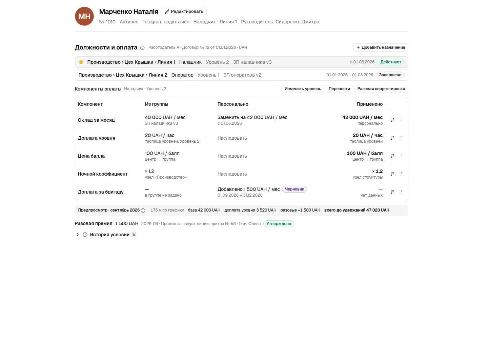
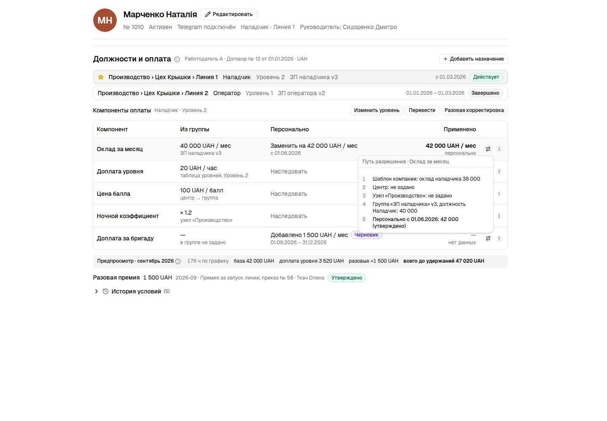
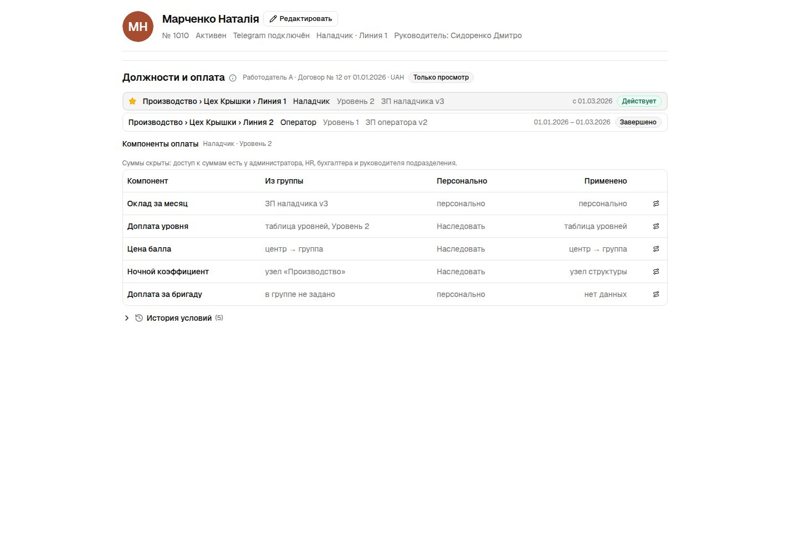
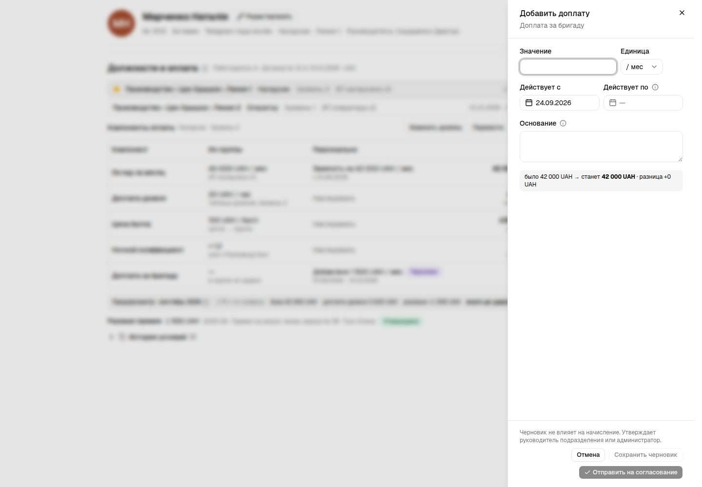
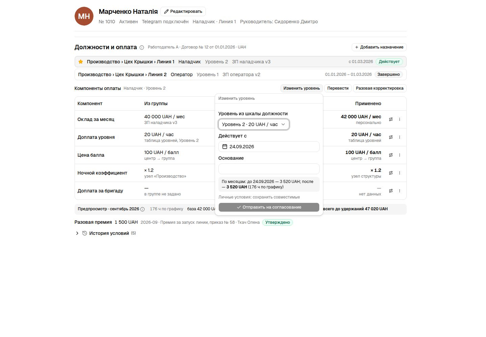
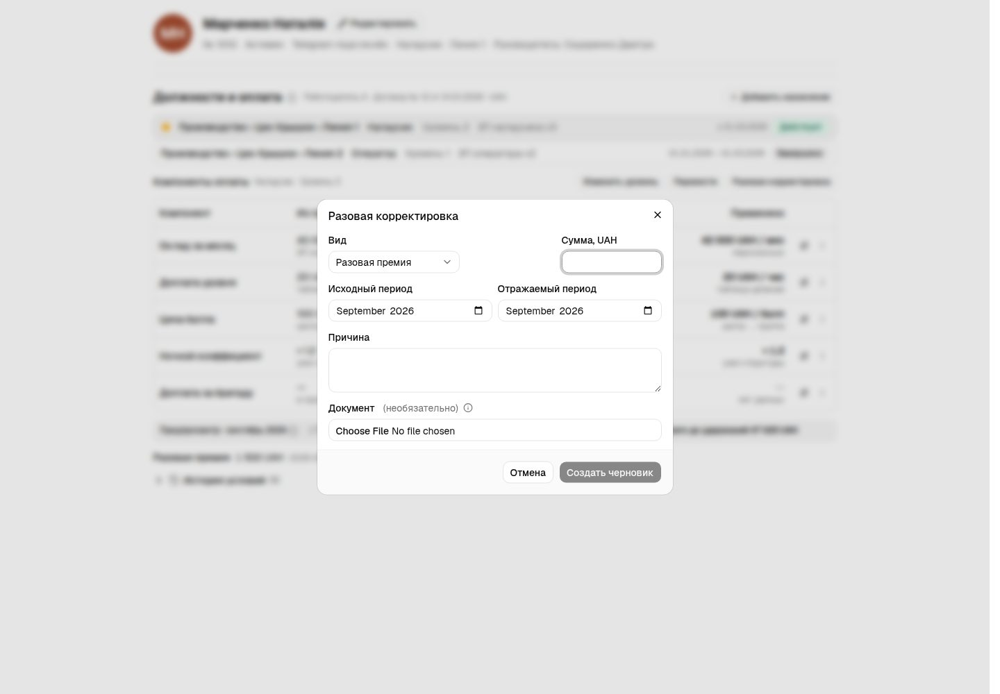
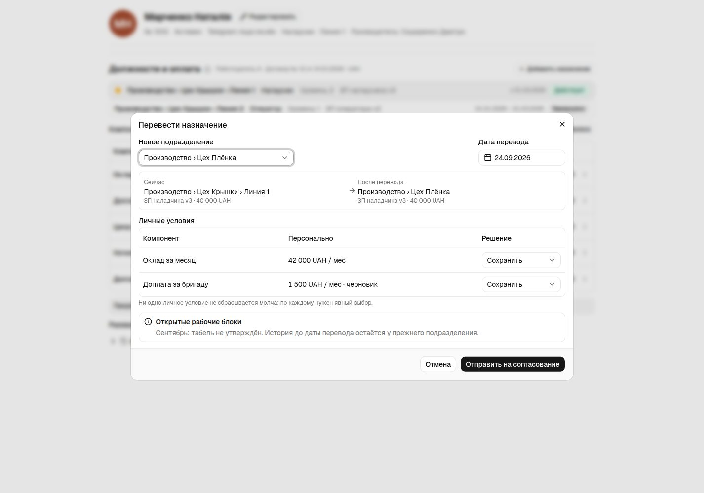
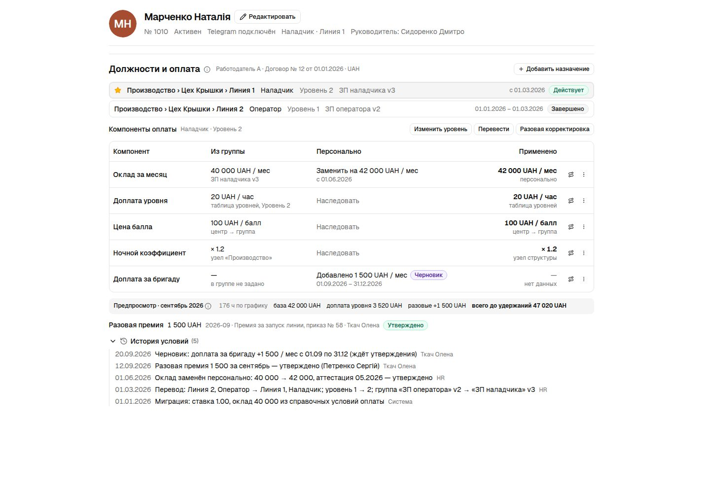
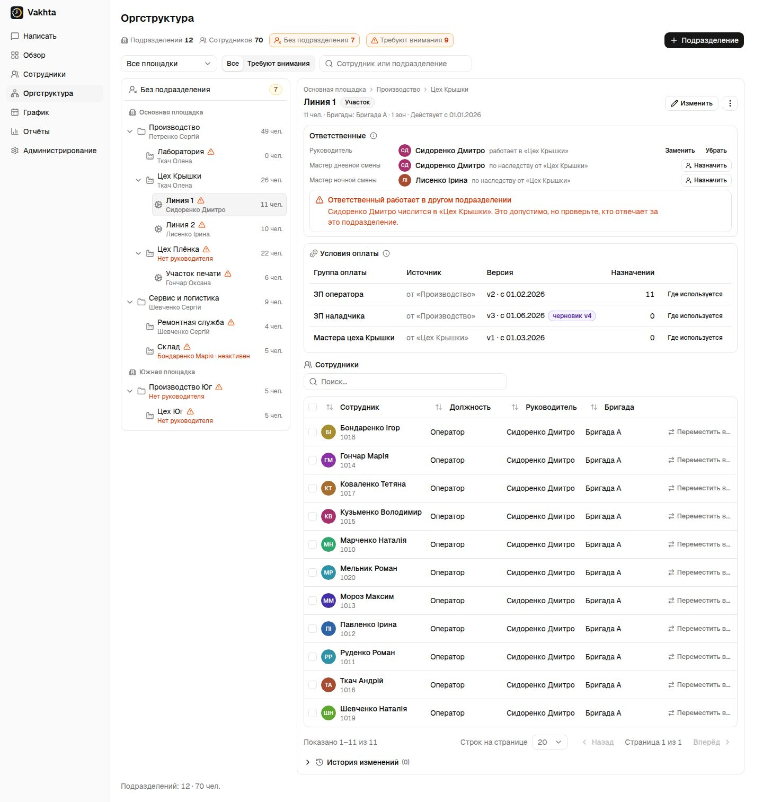
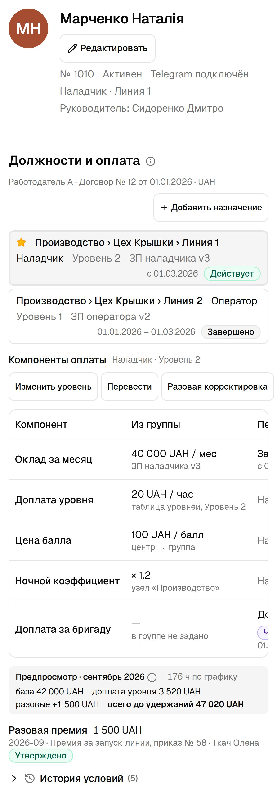

# Feature Specification: Employee card — assignments, pay groups, levels and personal terms

**Change**: 015-employee-card-pay-terms | **Created**: 2026-09-24 | **Status**: Draft (depends on
014; open decisions listed at the end) | **Baseline**: `006ef98` | **Checkout**:
`claude/practical-bohr-1ihj4g` (session branch; the owner's rule is master)
**Authority**: Owner request 2026-09-24: read the customer's "ТЗ учёт времени и зарплата v0.1"
(редакция 0.10) and extend the interface and logic of the organisation structure and the employee
card accordingly. Requirement IDs below (SYS, ORG, TREE, RESP, CFG, UI, PROC, GRP, LVL, TIME, S)
refer to that document.
**Product document**: [Admin panel](../../docs/features/11-admin-panel.md) (§ Сотрудники), new
`docs/features/14-pay-terms.md` on delivery. Related: [spec 014](../014-org-structure-foundation/spec.md),
[spec 005 employee profile](../005-employee-profile/spec.md).
**Engineering memory**: [employee-profile.md](../../docs/engineering/features/employee-profile.md),
[unit-management-workspace.md](../../docs/engineering/features/unit-management-workspace.md).

## RECON: Current Behavior

**The card today** (`apps/admin-web/src/features/employee-profile/ui/profile-page.tsx`,
`packages/contracts/src/employee-profile.ts:83-128`): header (name, number, status, Telegram,
position · unit, zone, master with warnings, block/terminate), then Contacts, Work (position, unit,
team, zone, month zones, paged history of `employee_positions`), Personal, Schedule · month, and
a full-width **Условия оплаты** section. There are no tabs; one Edit switches the personal fields
to a TanStack Form editor and the work fields to `PositionPanel` (`admin/EmployeesTab.tsx:822-974`).

**Pay terms today** are reference data by decision D-01/D-03 of spec 005: `employee_compensation_entries`
(`employment_rate` 0.01–1.00, `hourly_rate`, `monthly_salary`, `currency = 'UAH'`, dated
`effective_from`, append-only with reasoned corrections; `packages/db/src/schema/compensation.ts`,
migration `0050`). ADMIN and HR write, ACCOUNTANT reads, everyone else sees nothing
(`packages/domain/src/employee-profile/field-access.ts`). Nothing reads them: the bonus takes a
manually entered base per period (`POST /admin/bonus/period/:id/base`), the schedule and reports
never price hours. The section says so ("Справочные данные. Зарплата не рассчитывается.").

**One assignment at a time.** `employee_positions` holds unit, position, team, manager and dates;
`assign` closes the open row and inserts one. There is no employer/legal entity, no share of a
base between nodes, no level, no pay group, no personal exception. `positions` is `{code, name}`;
`qualifications` exist only for staffing requirements.

**Time facts that payroll will read** already exist per shift: `shift_summaries` (planned, total,
work, preparation, service, break, meal, downtime, late, early-leave, overtime minutes),
`activity_intervals` with non-overlap, `presence_sessions` separate from work, `overtime_approvals`,
`requests` (VACATION, SICK, DAY_OFF, LATE, EARLY_LEAVE, CORRECTION, EXTRA_SHIFT) with
`medical_media_id`. There is no monthly per-employee hours rollup and no табель; holidays are a
hard-coded Ukrainian list.

**What the customer's TZ asks that touches the card and the structure** (facts, not decisions):

- ORG-03: separate the _person_, the _employment_ (employer, contract, legal profile, currency,
  dates) and the _assignment_ (node, position, duties, qualification level, pay group, personal
  exceptions). Authority is a separate role. ORG-04: one person may hold several positions, levels
  and rates in one month; termination ends one employment and keeps the others.
- TREE-04: each assignment has one primary area of responsibility; work across several sections
  is either a share split of one base (shares sum to 100 %) or separate assignments. TREE-05:
  parent aggregates count distinct people and assignments separately.
- GRP-01..10, LVL-06..09, CFG-02..07: a pay group is a named, versioned set of component rules
  whose members are assignments; a level scale belongs to a position; each component of an
  assignment resolves as _personal replace → group rule for position+level → position → group
  default → nearest node value → centre → company template_, and the card shows the columns
  «из группы», «персонально», «применено» with the effective date, the resolution path and a
  before/after preview. Modes per component: inherit, replace, add (own key), disable (when
  allowed), return to inheritance. Zero is a value, blank is "no data".
- GRP-09/10: a one-time correction from the card carries employer, assignment, source and
  reflecting periods, kind, amount or quantity, reason and attachment; it never changes the group
  or next months; reductions of already accrued amounts go through the correction stage.
- PROC-05 (personal exception / level raise) and PROC-06 (moving a node or an employee): dated,
  previewed, approved; the old path is kept until the date; exceptions are carried over by explicit
  choice, never silently dropped (CFG-06).
- UI-07: the card first selects the employment and the assignment; tabs conditions, schedule/time,
  tasks, points, calculation, payments, documents, history; money fields only for authorised roles;
  every edit creates a reason or a version. UI-10: from a sum down to the formula and the primary
  fact.
- RESP-02/03: qualification level, organisational role and responsibility level are three
  different attributes; responsibility pays only through an explicit component.
- S13–S18: hire and termination mid-month, salary change mid-month, one salary across two
  sections, two positions with one tax allowance — all need dated assignments and terms.

## SPEC: Outcome and Boundaries

The card's «Условия оплаты» stops being a reference block and becomes **«Должности и оплата»**:
the one place where a person's employments, assignments and pay terms are read and changed, with
every value showing where it comes from, from which date, and what it will produce. The
organisation structure (spec 014) gains the pay-terms layer that the card resolves against: a pay
group attached to a node (or several), a level scale per position, and a per-node summary of what
applies there. Payroll calculation itself is out of this change; the outcome is that when the
calculation module arrives it reads assignments and resolved components as facts instead of
reference text.

Non-goals (this change):

- gross-to-net calculation, taxes, national packages (§ 12), advances, payment registers, bank
  files (§ 13), the timesheet document (§ 7 табель) and reports R01–R40 (§ 14, § 17) — they
  become consumers;
- the rules constructor (§ 9) beyond the fixed component catalogue below;
- an approval-route engine (§ 11) beyond one step: the node head (or ADMIN) approves personal
  terms, ADMIN publishes group versions;
- multi-company tenancy changes (the control plane already isolates tenants);
- changing how bonus points are earned; the point price becomes a component the bonus money
  will later read.

Assumptions (defaults; each overridable by the owner):

- **A1 One employer to start.** `employers` is a table (name, legal profile, currency), one row
  per tenant created by migration; every employment references it. Multiple employers per tenant
  is a later change that needs no card redesign.
- **A2 Assignment = `employee_positions` extended**, not a new table: `employment_id`, `share`
  (percent of the base, default 100), `is_primary`, `pay_group_id`, `level_id`, `manager_employee_id`
  stays as the explicit override. Shares of one employment's concurrent open rows must sum to 100.
- **A3 Component catalogue, fixed for this change**: `BASE_SALARY` (per month), `HOURLY_RATE`,
  `SHIFT_RATE`, `LEVEL_SUPPLEMENT` (from the level scale), `POINT_PRICE`, `NIGHT_COEFFICIENT`,
  `LEAD_SUPPLEMENT` (RESP-03). Each has a unit, a base and compatibility (a salary and an hourly
  rate cannot both be the base of one assignment; a supplement needs a base).
- **A4 Resolution order** exactly as CFG-02/03; the nearest-node layer uses spec 014's tree as of
  the date. A conflict of two sources of equal specificity is an error, never "last wins".
- **A5 Migration of today's compensation entries**: `employment_rate` → the primary assignment's
  FTE (`fte`, kept separate from `share`), `monthly_salary` → personal REPLACE of `BASE_SALARY`,
  `hourly_rate` → personal REPLACE of `HOURLY_RATE`, with the entry's `effective_from` and reason;
  corrected entries become closed versions. The old table is kept read-only for one release.
- **A6 Level scale per position** (`position_levels`: position, code, name, order, supplement
  method and value); an assignment's level must belong to its position's scale (LVL table
  "Уровень: выбор только из шкалы этой должности").
- **A7 Approval**: a personal change is `DRAFT → APPROVED` by the node head (spec 014 slot) or
  ADMIN; a group version is `DRAFT → PUBLISHED` by ADMIN after an impact plan (CFG-08) listing
  members, exceptions kept and the money difference for the month. Approval on desktop only is a
  TZ rule (UX-04) enforced server-side by role, not by device, in this change.
- **A8 Currency** comes from the employer; the card shows one currency per employment.

## User Scenarios and Testing

### US1: The card explains a person's pay terms at a glance (Priority: P1)

- **AC-001**: «Должности и оплата» lists the person's employments (employer, contract dates,
  currency) and, under each, its assignments: node path, position, level, pay group and version,
  share and FTE, dates, state (`ACTIVE | SCHEDULED | ENDED`). The primary assignment is marked.
- **AC-002**: Selecting an assignment shows the components table with columns Компонент · Из
  группы · Персонально · Применено · Действует с; each row names its source (`из группы v3`,
  `таблица уровней`, `узел «Производство»`, `персонально`, `отключено`) and opens the resolution
  path (CFG-07) in a popover.
- **AC-003**: A preview line shows for the chosen month: base, level supplement, total accrued
  before deductions, computed from planned hours of the month and the resolved components
  (management preview only, labelled as such).
- **AC-004**: Roles: ADMIN and HR read and write; ACCOUNTANT reads; the node head reads the
  assignments in their subtree; everyone else sees the section without amounts (position, level,
  group name only). Amounts never appear in the read-only Sheet or the employee list.

### US2: Assign, transfer and split (Priority: P1)

- **AC-005**: «Добавить назначение» asks employment, node, position, level (from the scale),
  pay group (offered: groups attached to the node or its ancestors, then all), share, FTE and
  effective date; an assignment whose shares with the other open rows exceed 100 % is rejected
  (`SHARE_SUM_EXCEEDED`).
- **AC-006**: «Перевести» (PROC-06) on an assignment shows old and new sources for every
  component (from the new node's groups and the old personal exceptions), asks what to do with
  each personal exception (`keep | replace | inherit`, LVL-09) and the effective date; nothing is
  dropped silently (CFG-06). The org-structure "Переместить в…" popover of spec 014 reuses this
  step when the target node changes the resolved terms.
- **AC-007**: Ending an assignment (termination of an employment, S14) sets `valid_to` and keeps
  every other assignment and the history; the card shows the ended assignment under История.

### US3: Change a level or a personal term (Priority: P1)

- **AC-008**: «Изменить уровень» (PROC-05, LSTEP-01..06) picks a level from the position's scale,
  an effective date and a reason; the preview shows the difference by month segments (S15) and the
  compatibility of existing personal components; the change is a DRAFT until approved.
- **AC-009**: «Изменить для сотрудника» on a component creates a REPLACE version with start,
  optional end, reason, author; a temporary replace states what applies after the end (return to
  the group or a named version).
- **AC-010**: «Добавить доплату» creates an ADD component with its own key and unit after a
  compatibility check; «Отключить» is offered only where the catalogue allows; «Вернуть условия
  группы» ends the personal version from a date and keeps history.
- **AC-011**: «Разовая корректировка» (GRP-09) records kind, amount or quantity, source period,
  reflecting period, reason, attachment; it appears in the month preview and in История and never
  changes any component version.

### US4: Group changes reach the right people (Priority: P1)

- **AC-012**: In Оргструктура, a node's detail shows «Условия оплаты»: pay groups applied on the
  node (own or inherited, with the source node), their published version and date, counts of
  assignments and distinct people (TREE-05), and «Где используется».
- **AC-013**: Publishing a new group version shows the impact plan first (CFG-08, R37): members,
  who inherits, who keeps a personal exception, the money difference for the month; publication is
  atomic; members who joined after the plan are not included silently.
- **AC-014**: A personal REPLACE survives a group publication (GRP-06); an INHERIT row follows
  the version valid on the date.

### US5: History and audit (Priority: P2)

- **AC-015**: Every version, override, adjustment and approval is a row in the assignment's
  История with who, what, when, why, and links to the group version and node version it resolved
  against; the audit log stores IDs and field names for amounts (spec 005 rule), never values.

### Edge Cases

- Hire mid-month (S13) and termination mid-month (S14): the preview prorates by the profile's
  method; the card shows the assignment's dates, not a reduced norm.
- Salary change mid-month (S15): two dated REPLACE versions; the preview shows both segments.
- One salary across two sections (S17): two assignments of one employment with shares 62.5/37.5;
  the base is accrued once; each node's «Условия оплаты» counts the person once.
- Two positions (S18): two assignments with their own bases; the card shows both under one
  employment.
- A level not on the position's scale after a position change: the card flags
  `LEVEL_NOT_IN_SCALE` and asks for a new level with a date.
- A group attached to no node: allowed (GRP-01), listed under the employer in Оргструктура.
- A node moved under another parent (spec 014): inherited group sources change from the date; the
  impact plan of the move lists affected assignments (TREE-03).
- Mobile: the components table becomes cards; approval actions are hidden below 768 px (UI-09)
  and refused by the server for the same roles regardless of device.

## Requirements

### Functional Requirements

- **FR-001**: Tables `employers`, `employments` (employee, employer, contract number, legal
  profile code, currency, valid_from/valid_to) and the extended `employee_positions` (A2) with a
  check that concurrent shares of one employment sum to ≤ 100 and an exclusion constraint against
  two primary rows overlapping. Verified by AC-005, AC-007, migration tests.
- **FR-002**: `pay_groups` (employer, name, archived_at), `pay_group_versions` (valid_from,
  status DRAFT|PUBLISHED, published_by), `pay_group_rules` (version, component_key, position_id
  null, level_id null, value, unit), `pay_group_nodes` (group ↔ node attachment with mode
  `pinned | by_assignment_node`, CFG-04). Verified by AC-012–AC-014.
- **FR-003**: `position_levels` scale per position (A6). Verified by AC-008.
- **FR-004**: `assignment_term_versions` (assignment, component_key, mode INHERIT|REPLACE|ADD|
  DISABLE, value, unit, valid_from, valid_to, after_end `GROUP | VERSION:<id>`, reason, status
  DRAFT|APPROVED, author, approver) and `one_time_adjustments` (GRP-09 fields). Both append-only
  like compensation entries. Verified by AC-009–AC-011, AC-015.
- **FR-005**: `packages/domain` exports `resolveComponent({assignment, key, at, sources})` →
  `{value, unit, source, path[]}` with the CFG-02/03 order and the equal-specificity conflict;
  `monthPreview({assignment, plannedMinutes, at})` for AC-003; both pure and property-tested.
- **FR-006**: API: `GET /admin/employees/:id/pay-terms?asOf` (employments, assignments, resolved
  components, adjustments, history); `POST /admin/employees/:id/assignments`;
  `POST /admin/assignments/:id/transfer` (AC-006 with the exceptions decision); `PATCH
/admin/assignments/:id/level`; `POST /admin/assignments/:id/terms`; `POST
/admin/assignments/:id/adjustments`; `POST /admin/assignments/terms/:id/approve`;
  `GET/POST /admin/pay-groups`, `POST /admin/pay-groups/:id/versions`, `POST
/admin/pay-groups/versions/:id/impact`, `.../publish`; `GET /admin/org/units/:id/pay-terms`.
  Every write appends an audit row with IDs only and a domain event.
- **FR-007**: Access per A7 and AC-004; `field-access.ts` extends `compensation` into
  `payTerms: NONE | NAMES | READ | WRITE` and `payTermsApprove`.
- **FR-008**: The panel section «Должности и оплата» (features/employee-profile) implements
  US1–US3 and US5; Оргструктура's node detail implements AC-012; the Employees list shows level
  and group names without amounts. All copy in three catalogs; component keys, modes and states as
  `as const` objects with `z.enum`/`pgEnum`.
- **FR-009**: Migration per A5 with a reconciliation test that every current employee's effective
  compensation equals the resolved `BASE_SALARY`/`HOURLY_RATE` on the migration date.

### Key Entities

- **Employer**, **Employment** (new): the legal side of the person (ORG-03).
- **Assignment** (`employee_positions`, extended): node, position, level, pay group, share, FTE,
  primary flag, manager override, dates.
- **PayGroup / PayGroupVersion / PayGroupRule** (new): named, versioned component rules; members
  are assignments through `pay_group_id`.
- **PositionLevel** (new): the scale a level is chosen from.
- **AssignmentTermVersion** (new): the personal layer; **OneTimeAdjustment** (new).
- **ResolvedComponent** (domain value): value + unit + source + path, never stored except inside
  a calculation snapshot (later change).

## Success Criteria

- **SC-001**: For any assignment and date, `resolveComponent` returns one value with a path that
  the card renders verbatim; two sources of equal specificity produce an error, not a value
  (AC-002, FR-005).
- **SC-002**: Changing a group version never changes a personal REPLACE; returning to inheritance
  never deletes history (AC-014, AC-010).
- **SC-003**: A transfer or level change is impossible without a date, a reason and an approval
  step; nothing about a person's terms changes silently (AC-006, AC-008).
- **SC-004**: After migration, every employee's card shows the same base salary and hourly rate as
  the compensation section did on the migration date (FR-009).
- **SC-005**: Amounts are visible only to ADMIN, HR, ACCOUNTANT and the subtree head; the read-only
  Sheet, lists and the org section's people table show names of groups and levels only (AC-004).

## Verification Scope

Classification: **money + access + migrations** → invariant tests on PostgreSQL for FR-001,
FR-002, FR-004 constraints and FR-009 reconciliation; property tests for FR-005; contract tests
for FR-006; panel unit tests for the section's states (read, write, approve, mobile) and the
resolution-path popover; Playwright captures of the card (desktop/mobile) and the node pay block;
one independent review of FR-005 and FR-007. Live QA only for the card and the node detail.

## Prototype (visual reference for this spec)

Fixture-rendered on the panel's components: the card section «Должности и оплата» (assignments,
components with sources, level change, personal replace, one-time correction, transfer with
exception decisions, history) and the node «Условия оплаты» block in Оргструктура. Captures in
`docs/engineering/evidence/pay-terms-2026-09-24/`; the shared page is linked from the engineering
memory. Every state with a caption:
[capture gallery](../../docs/engineering/evidence/pay-terms-2026-09-24/README.md).

### Key screens

The section: employment line, assignments, components with «Из группы · Персонально ·
Применено», month preview, one-time corrections, history (AC-001, AC-002, AC-003).

Resolution path of one component (AC-002, CFG-07).

Names only: a role that sees groups and levels without amounts (AC-004).

Personal replace of a component (AC-009).

Add a supplement (AC-010).

Level change from the position's scale with a per-month preview (AC-008, PROC-05).

One-time correction (AC-011, GRP-09).

Transfer with old and new sources and a decision per personal exception (AC-006, PROC-06).

History expanded (AC-015).

Node block «Условия оплаты» in Оргструктура (AC-012), captured with the org structure set.

Mobile (Edge Cases).

## Open decisions

- **D1** Keep one employer per tenant for the first delivery (A1) or model several employers now
  (ORG-02 allows different employers under one node)?
- **D2** Is the head of the node the approver of personal terms (A7), or HR/ACCOUNTANT (§ 11 routes
  are not implemented here)?
- **D3** The fixed component catalogue (A3): is `SHIFT_RATE` needed for the pilot, and does
  `LEAD_SUPPLEMENT` replace any current practice of paying masters outside the system?
- **D4** Levels per position (A6) or per pay group (GRP-02 allows both)?

## Owner answers 2026-09-25: pay (questions 19, 21–25)

The owner answered the pay questions of #118. Each answer changes an assumption above; the rest
stands. Questions 26–40 (groups, levels, approval, one-time payments, month, rollout) stay open.

- **Q21–Q22.** Not answered; the defaults hold: one employer, one currency (UAH), both
  overridable later without a card redesign.
- **Q23, kinds of pay, in the owner's priority order:** per shift, per hour, per output
  (выработка), for plan fulfilment. No monthly salary was named. Change to A3: `SHIFT_RATE` and
  `HOURLY_RATE` are the primary bases; `BASE_SALARY` stays in the catalogue for administrative
  positions only; **`PIECE_RATE` (output) and `PLAN_BONUS` need an output or plan fact that the
  product does not record (AGENTS.md: orders, output and OEE are out of MVP)**, so they are
  named in the catalogue as reserved and deferred to a separate decision. Open: where output
  numbers would come from (Q23a) and whether "for plan fulfilment" is the existing points bonus
  or a separate production plan (Q23b), whether anyone is on a monthly salary (Q23c).
- **Q24, allowances, primary set:** night, weekends and holidays, extra shifts, level (разряд),
  seniority (стаж). Change to A3: add `WEEKEND_COEFFICIENT` (applied to shifts on weekends and
  public holidays from the schedule calendar), `EXTRA_SHIFT_RATE` (shifts above the monthly norm
  of the schedule), `SENIORITY_SUPPLEMENT` (a scale by years of service from
  `employments.valid_from`, per pay group), keep `NIGHT_COEFFICIENT` and `LEVEL_SUPPLEMENT`;
  `LEAD_SUPPLEMENT` stays but is not primary. Add `COMBINATION_SUPPLEMENT` (percent of the base
  for doing the work of two, spec 014 Q19). Open: weekend as a coefficient or a double rate,
  extra-shift rate, seniority scale (Q24a).
- **Q19, several nodes and pay.** No percentage shares: a home node plus a service scope (spec 014) and a dated `COMBINATION_SUPPLEMENT` with a reason. Change to A2: `share` is dropped;
  `fte` stays for the employment rate; S17 in Edge Cases is replaced by "one assignment, service
  scope, supplement".
- **Q25, where the terms live.** Excel, with a typical rate per position. Change to A5 and
  FR-009: the migration seeds one pay group per position from that sheet (shift and hourly
  rates, night and weekend coefficients, level and seniority scales) and records each person's
  deviation from the typical rate as a personal exception with the reason «перенос из таблицы»;
  the existing compensation entries are reconciled against the same sheet. Open: a copy of the
  sheet without names for the import design (Q25a).
- **Month preview (AC-003).** Because the bases are per shift and per hour, the preview is
  computed from the month's planned shifts and their attributes (night, weekend, above norm)
  rather than from planned hours alone; `monthPreview` takes the shift list.

Follow-up questions: Q23a source of output numbers; Q23b plan bonus vs the existing points
bonus; Q23c monthly salary for anyone; Q24a weekend coefficient or double rate, extra-shift
rate, seniority scale; Q25a the rates sheet without names.
